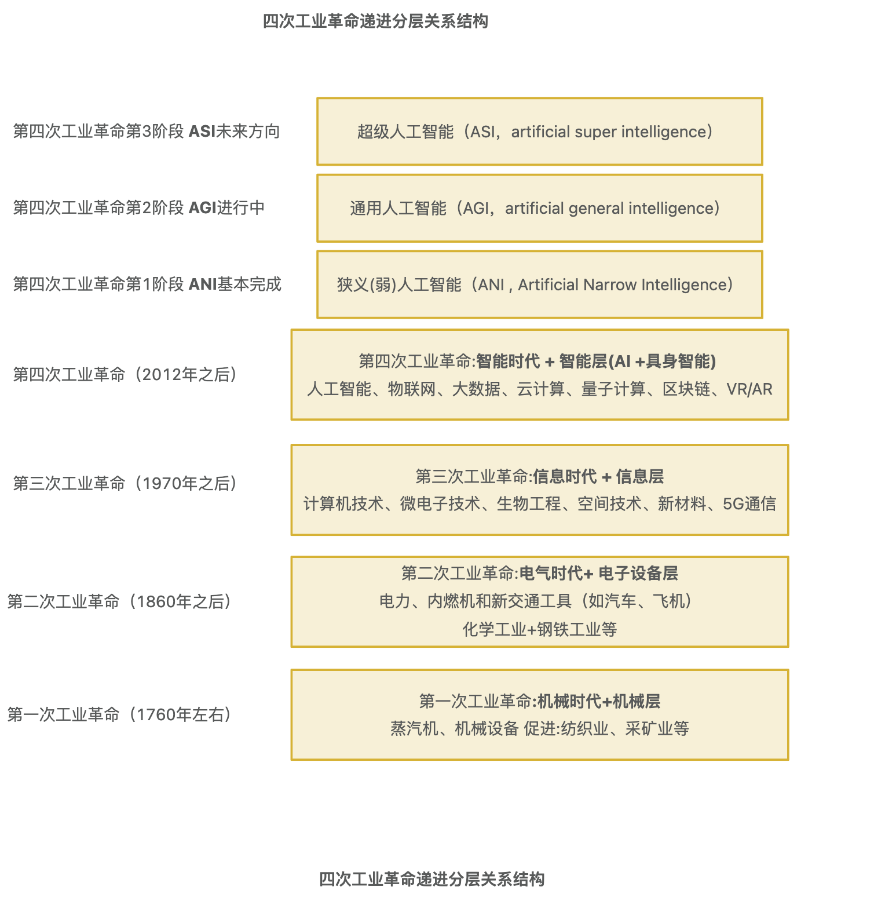
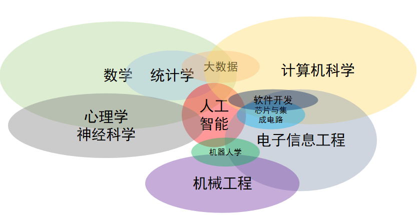
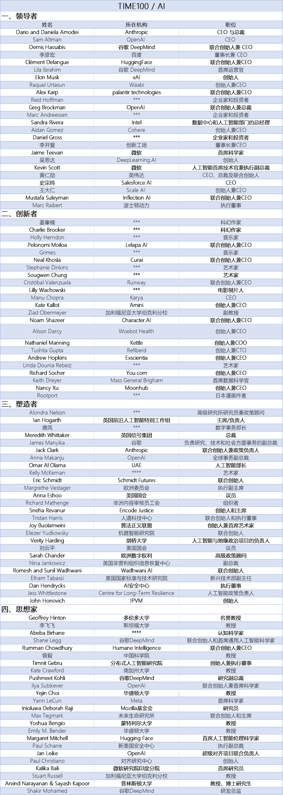
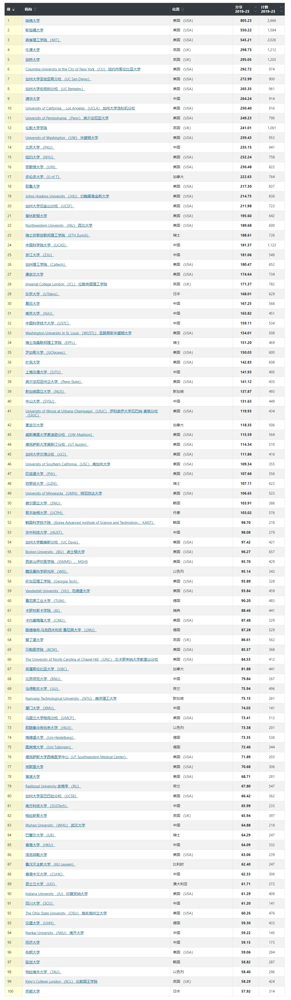

# ai-learning-roadmap 人工智能学习路线 V0.3
分享就是最好学习和成长!
(Sharing is the best way to learn and grow!)

**版本更新说明**: V0.3 (2026年4月) 在 V0.2 (2025年1月) 基础上进行全面升级，新增 AI 教育领域人物专题、AI Agent 框架生态、2025-2026 大模型最新进展、具身智能引导等内容。

# 该项目仪表盘
总体进度: 35%
V0.3 版本完成

# 目录
- [一、为什么要做这个项目？](#一-为什么要做这个项目)
  - [1 愿景和目标](#1-愿景和目标)
  - [2 前三次工业革命背景介绍](#2-前三次工业革命背景介绍)
  - [3 第四次工业革命在哪里](#3-第四次工业革命在哪里)
- [二、人工智能背景及学习方法](#二-人工智能背景及学习方法)
  - [1 人工智能的定义](#1-人工智能的定义)
  - [2 人工智能与其他学科的关系图](#2-人工智能与其他学科的关系图)
  - [3 AI领军人物和AITop100大学](#3-ai领军人物和aitop100大学)
  - [4 AI亚洲领军人物](#4-ai亚洲领军人物)
  - [5 AI教育领域引领者](#5-ai教育领域引领者)
  - [6 自驱自学终身学习践行者-推荐布鲁姆分类法学习路径](#6-自驱自学终身学习践行者-推荐布鲁姆分类法学习路径)
- [三、人工智能学习路线](#三-人工智能学习路线)
  - [1 初级|中级|高级工程师(P4-P6)学习路线](#1-初级-中级-高级工程师p4-p6学习路线)
  - [2 专家|高级专家|资深专家(P7-P9)进阶路径](#2-专家-高级专家-资深专家-p7-p9-进阶路径)
  - [3 研究员|高级研究员|资深研究员|科学家|资深科学家(P10-P14)成神路径](#3-研究员-高级研究员-资深研究员-科学家-资深科学家-p10-p14-成神路径)
- [四、人工智能引领者](#四-人工智能引领者)
  - [1 国际引领者](#1-国际引领者)
  - [2 国内引领者](#2-国内引领者)
  - [3 行业引领者](#3-行业引领者)
  - [4 场景引领者](#4-场景引领者)
- [五、AI Agent 框架与工具生态](#五-ai-agent-框架与工具生态)
- [六、开源社区 项目 产品 应用](#六-开源社区-项目-产品-应用)
- [七、参考 引用](#七-参考-引用)
- [八、免责申明](#八-免责申明)

# 一 为什么要做这个项目
## 1 愿景和目标
通往AGI/ASI之路

### 要实现超级人工智能(AGI/ASI)也许有很长的路要走
### 我们的目标是让每个人的学习过程少走弯路，让更多的人因AI而强大！
### 让超级人工智能(AGI/ASI)为人类创造更加美好的明天！

AI是科学与艺术结合
我们相信 AGI 是模型x数据x算力的暴力美学，我们相信大模型是科研+工程+组织的优雅艺术。

人工智能远比其他技术更加深刻、更加强大。对个人来说风险不在于媒体过度炒作，而在于错过即将到来的AI浪潮。
既懂产品开发又精通AI的人才，预计这种人才短缺需求将会加剧。
我相信，只要心中有光，就一定能照亮前行的道路。

**V0.3 新增观察**: 2025-2026年，AI已从"聊天机器人时代"全面迈入"AI Agent时代"。能够编排LLM、工具和数据来创造商业价值的工程师，比单纯构建模型的人才更加稀缺。具身智能(Embodied AI)与机器人产业的融合也正在成为第四次工业革命的核心方向之一。

## 2 前三次工业革命背景介绍

### 1. 第一次工业革命（18世纪末至19世纪初）
 - 起源：始于英国，约在1760年至1840年之间。
 - 核心技术：蒸汽机、纺织机械、煤矿开采、铁路建设。
 - 重要标志：
    - 蒸汽机的发明和应用，特别是詹姆斯·瓦特改进的蒸汽机，成为工业化的核心动力。
    - 纺织工业的机械化，取代了传统的手工劳动。
    - 铁路和蒸汽船的出现，推动了交通运输和商品流通。
 - 社会影响：大规模的机械化生产取代了手工业，促进了城市化进程，社会经济结构发生剧变。
### 2. 第二次工业革命（19世纪中期至20世纪初）
 - 起源：主要发生在19世纪中后期的欧美国家。
 - 核心技术：电力、内燃机、钢铁、化学工业、自动化。
 - 重要标志：
    - 电力的普及，尤其是发电技术的发展（如爱迪生和特斯拉的贡献），电力开始广泛应用于生产和生活中。
    - 内燃机和汽车的发明，亨利·福特的流水线生产方法大大提高了生产效率。
    - 钢铁工业的迅速发展，尤其是贝塞麦法（Bessemer Process）等技术的出现，使得钢铁大量生产成为可能。
    - 化学工业的兴起，催生了新的材料和药品的生产。
 - 社会影响：大规模的工业化和全球化的贸易，带来大规模的城市化、工人阶级的崛起以及社会结构的变化。
### 3. 第三次工业革命（20世纪中叶至末期）
 - 起源：从20世纪中期开始，尤其是在欧美和日本，持续到20世纪90年代。
 - 核心技术：信息技术、计算机、互联网、自动化控制。
 - 重要标志：
    - 计算机的普及，个人计算机和服务器的出现，使得信息处理能力大大增强。
    - 互联网的兴起，改变了全球通讯、信息流通和商业模式。
    - 自动化和机器人技术的应用，尤其是在制造业中，推动了生产效率的极大提升。
    - 数字化和信息化，从制造业到服务业，越来越多的行业开始依赖信息技术。
 - 社会影响：全球信息网络的形成，工作性质的变化，尤其是传统制造业与新兴技术产业之间的转型和替代。
### 4. 三次工业小结：
 - 第一次工业革命：蒸汽机和机械化生产。
 - 第二次工业革命：电力、内燃机、钢铁和化学工业。
 - 第三次工业革命：信息技术、计算机、手机、PC互联网、移动互联网和自动化。
每一次工业革命都极大地推动了社会经济和技术的进步，带来了工业生产方式、劳动力市场以及社会结构的深刻变化。

## 3 第四次工业革命在哪里
  也许在这里(没有人知道未来的事情，仅个人自己猜测和判断，不作为投资建议，注意: 市场有风险，投资需谨慎)

**第四次工业革命（也称为Industry 4.0）** 是指当前正在进行的一次技术革新浪潮，它的核心特征是将数字化、物理系统和生物技术结合起来，通过智能化的技术来推动生产和社会发展。这一革命并不像前三次工业革命那样有明确的开始时间，而是逐步发生的，它在21世纪初的某个时刻开始形成，并且依然在持续发展。
可能出现位置 比如: 新能源、人工智能(具身智能 含机器人)、量子信息技术、商业航天(卫星互联网)、可控核聚变、生物制造、基因技术、脑机接口等

四次工业革命图如下:

### 1. 核心技术：
  - **人工智能（AI）**：利用机器学习、深度学习、大语言模型、AI Agent等技术，使机器能够进行复杂的任务决策、推理、规划和自我优化。
    人工智能发展的三个阶段：
    - 1 ANI狭义人工智能（ANI , Artificial Narrow Intelligence）
    - 2 通用人工智能（AGI，artificial general intelligence）
    - 3 超级人工智能（ASI，artificial super intelligence）
  - **具身智能与机器人技术**：智能机器人与AI深度融合，人形机器人从实验室走向量产，2025年全球出货超13,000台。
  - **物联网（IoT, Internet of Things）**：将设备、传感器和机器联网，实现实时数据收集和分析，增强智能决策能力。
  - **自动|无人驾驶**：智能自动无人驾驶 天上飞的各种无人机或自动驾驶飞机、仿生类昆虫鸟类等等; 地上跑自动驾驶汽车、火车、地铁、物流车队、或地下勘探、矿类无人机器; 江河湖海洋水里自动|无人驾驶轮船 或潜艇 仿生海洋生物。
  - **大数据和云计算**：通过海量数据的收集、存储和处理，帮助企业做出更加精准的决策和运营优化。
  - **3D打印（增材制造）**：能够直接根据数字模型制造物品，极大地提高了生产的灵活性与定制化。
  - **虚拟现实与增强现实（VR/AR）**：增强了人的感知体验，广泛应用于设计、制造、医疗、教育等领域。
  - **区块链技术**：确保数据的安全性和透明度，尤其在金融、供应链等领域中获得应用。
  - **基因编辑与生物技术**：利用CRISPR等技术进行基因修改，带来医学和农业领域的重大突破。
  - **脑机接口（BMI）**：实现人-机交互，使患者能够通过脑电波控制设备，甚至实现与机器的直接沟通。
  - **空间智能（Spatial Intelligence）**：AI从理解文本和图像迈向理解三维物理世界（如World Labs的Marble模型）。
### 2. 特征与影响：
  - **智能化与自动化**：生产线、物流、仓储等流程变得更加智能化，机器和设备能够自主工作，减少人工干预，提升效率和精度。
  - **融合与互联**：不同领域的技术（如AI、IoT、大数据等）相互融合，带来全新的商业模式和运营方式。
  - **数据驱动决策**：大量数据的采集和分析为企业提供实时、精确的运营支持，优化生产过程并做出灵活调整。
  - **定制化与个性化**：制造商可以根据市场需求和消费者的个性化要求快速调整生产，并通过3D打印等技术实现小批量生产。
  - **生产与服务边界模糊**：智能化技术不仅影响了传统制造业，也改变了服务业的运营模式，甚至开始出现智能服务和智能医疗等新兴行业。
  - **AI Agent自主执行**：AI从被动回答问题走向主动完成多步骤复杂任务，自主编码、自主操作计算机已成为现实。
### 3. 应用领域：
  - **制造业**：智能工厂、自动化生产线、机器协作和自适应生产。
  - **交通与物流**：无人驾驶汽车、智能交通系统、无人机配送。
  - **医疗健康**：精准医疗、个性化治疗、远程手术和机器人辅助手术、AI药物发现。
  - **农业**：精准农业、自动化农业设备、智能灌溉系统。
  - **金融**：区块链、数字货币、智能合约、金融技术（FinTech）、量化交易。
  - **零售**：虚拟现实购物、自动化库存管理、智能推荐系统。
  - **软件工程**：AI辅助编程（Copilot、Cursor等），自主编码Agent。
  - **教育**：AI个性化教学、智慧教育平台、AI教学助手。
### 4. 全球发展趋势：
第四次工业革命没有局限于某一个国家或地区，而是全球范围内的技术变革。它在不同地区和国家的表现形式有所不同，发达国家如美国、德国、日本和中国等，正在加快推进相关技术的研究和应用。
  - **美国**：科技公司和初创企业在AI、大数据、云计算等领域的创新推动了第四次工业革命。Stargate项目投资5000亿美金构建AI基础设施。
  - **中国**：以人工智能、5G、物联网等技术为核心，推动制造业的转型升级。具身智能首次写入政府工作报告，"十五五"规划将其列为新质生产力核心赛道。
  - **德国**：提出了"工业4.0"概念，强调工业制造的数字化、智能化。
  - **欧盟**：《EU AI Act》正式生效，全球首部全面AI监管法规。

### 5. 面临的挑战：
  - **技术与人才短缺**：新技术的快速发展要求有大量专业技能人才，但目前各国仍面临技术人才短缺的问题。
  - **数据隐私和安全**：大量数据的采集和处理可能引发数据隐私泄露、网络安全问题。
  - **社会和劳动力转型**：自动化和人工智能将替代一些传统职业，带来就业结构变化，需要进行社会适应与再培训。
  - **伦理问题**：人工智能、基因编辑等技术的伦理界限仍是一个讨论的焦点，尤其是在人类基因改造和AI决策透明度等方面。
  - **AI安全与对齐**：确保AI系统行为符合人类价值观和意图，避免失控风险。
### 6. 总结：
第四次工业革命代表了技术的全面融合和智能化的飞速发展。它不仅仅是一场技术革命，更是一场社会、经济、政治乃至文化的深刻变革。随着AI、物联网、机器人等技术的广泛应用，世界各国都在积极推动这场变革，但也伴随着许多挑战和不确定性。

# 二 人工智能背景及学习方法
## 1 人工智能的定义
了解了人工智能的发展史后，我们现在或许可以大致理解现在对于人工智能的广泛定义——人工智能是人类设计的 机器或程序 所执行的与人类智能相对标的行为。
***
人类智能是人类理解和学习事物的能力，或者说，智能是 思考 和 理解能力 ，而不是本能做事的能力。例如：推理、判断、证明、决策、感知、理解、创作等多种多样的任务。
也可以说，人工智能是机器应用算法通过数据学习和使用所学，来进行如同人类决策的能力。
***
人工智能是数学、物理学、统计学、计算机科学、电子信息工程、控制工程、心理学、认知神经科学等多个 学科交叉 形成的产物。人工智能可以用来做机器人的一部分，可以用来做软件开发，可以赋能大数据，而5G代表的通信能力、芯片所代表的计算能力与存储能力又是人工智能得以发展起来的基座。这些学科彼此之间都有千丝万缕的联系，但绝对不能把它们简单地画等号。

## 2 人工智能与其他学科的关系图

## 3 AI领军人物和AITop100大学
## 3.1 全球AI最有影响力100人

## 3.2 杰夫·辛顿（Geoffrey Hinton）人工智能之父&图灵奖(2018)&诺贝尔物理学奖(2024)AI人物脉络图

## 3.3 《Nature》发布2024人工智能Top100大学榜单
国际Top3： 哈佛大学、斯坦福大学、麻省理工学院(MIT)
***
国内Top3:   清华大学、北京大学、中国科学院大学
***
注: 2024年4月27日,清华大学人工智能学院-该学院由计算机科学最高奖"图灵奖"得主、中国科学院院士姚期智先生领导  重点布局"人工智能核心"与"人工智能+"两大前沿方向。
***

## 4 AI亚洲领军人物
  - **1 姚期智** :2024年4月27日,清华大学人工智能学院-该学院由计算机科学最高奖"图灵奖"得主、中国科学院院士姚期智先生领导  重点布局"人工智能核心"与"人工智能+"两大前沿方向。
   姚期智 / Andrew Chi-Chih Yao  https://iiis.tsinghua.edu.cn/zh/yao/
   出版书籍 《人工智能 (高中版)》(2021-5)  《人工智能》(大学)(2022-8-1)
   姚期智：人工智能和机器人两大产业融合将是未来社会的核心产业 （新京报）
   张亚勤： 清华大学智能科学讲席教授、智能产业研究院院长，中国工程院外籍院士

  - **2 周志华** 南京大学副校长、计算机科学与人工智能学院教授
    周志华主要从事人工智能、机器学习、数据挖掘等领域的研究工作。ACM/AAAI/AAAS/IEEE Fellow，中科院院士。
    个人主页: https://cs.nju.edu.cn/zhouzh/
    出版书籍:
    - 《机器学习》(西瓜书), 清华大学出版社, 2016 (配套南瓜书公式推导)
    - 《机器学习理论导引》, 机械工业出版社, 2020
    - 《演化学习：理论与算法进展》(2019)
    - 《集成学习方法》(Ensemble Methods) 第二版英文版 (2025)
    研究方向: 集成学习、进化学习、弱监督学习、多标签学习、开放环境机器学习、学件(Learnware)等。
    2026年春季主讲南京大学《机器学习导论》课程。

 - **3 张志华**
    北京大学 张志华 北京大学数学科学学院教授，所在部门为统计学教研室，兼任Journal of Machine Learning Research 执行编委。
    个人主页: https://www.math.pku.edu.cn/teachers/zhzhang/

 - **4 李航**
  李航，毕业于日本京都大学电气电子工程系，日本东京大学获得计算机科学博士学位。现任北京大学、南京大学兼职教授，曾任职于日本NEC公司中央研究所、微软亚洲研究院、华为技术有限公司诺亚方舟实验室。字节跳动人工智能实验室总监。
    - 《统计学习方法》2016, 监督学习
    - 《统计学习方法》2019, 非监督学习
    - 《机器学习方法》2022 机器学习方法
    - 《机器学习方法》（第2版）2024.12 清华出版社 新增深度学习篇和强化学习篇，全书共分为4篇（或4册），对应监督学习、无监督学习、深度学习和强化学习4个主要分支。

 - **5 DeepSeek 梁文锋**
    DeepSeek(深度求索)创始人，幻方量化基金 https://www.high-flyer.cn/
    DeepSeek大模型出圈，以极低成本实现顶尖性能，震动全球AI行业。
    DeepSeek GitHub: https://github.com/deepseek-ai

 - **6 姚顺雨**
    "基模四杰" 是业内对姚顺雨、杨植麟、林俊旸、唐杰四位中国 AI 大模型领域顶尖领军人物的合称，他们分别代表了智能体、长文本、开源生态、学术产业四大方向。
    核心标签：腾讯最年轻首席 AI 科学家、前 OpenAI 研究员、智能体（Agent）技术奠基人
    教育背景：清华姚班本科，普林斯顿大学博士（师从 GPT 核心作者 Karthik R. Narasimhan）
    关键成就：
    - 提出ReAct（推理 + 行动）框架、ToT（思维树），奠定当代 AI 智能体底层范式
    - 前 OpenAI 核心研究员，主导UPRIT（AI 直接操作硬件）等前瞻项目
    - 2025 年底任腾讯首席 AI 科学家，直接向总裁刘炽平汇报，负责 AI 基础设施与大模型部
    技术方向：聚焦智能体、长序列推理、工具调用，推动 AI 从 "聊天" 走向 "做事"

 - **7 朱松纯 (Song-Chun Zhu)** —— 通用人工智能(AGI)先驱
    北京大学智能学院院长、北京大学人工智能研究院院长、北京通用人工智能研究院（BIGAI）院长。
    2020年从UCLA回国创建北京通用人工智能研究院。
    核心理论: 提出CUV框架——认知架构（C）、势能函数（U）、价值函数（V），突破传统AI对大数据和算力的依赖。
    重要成果:
    - ICLR 2025 主题演讲: "AGI：框架、原型、定义和基准"
    - 发布全球首个通用智能体"通通"（Tong Tong），具备类人价值观、可自主生成任务
    - 发布通用人工智能评级标准与测试平台（TongTest）和研究平台"通境"（TongVerse）

 - **8 李飞飞 (Fei-Fei Li)** —— 空间智能开拓者
    斯坦福大学教授、ImageNet创始人、前Google Cloud首席科学家。
    2024年创立 World Labs，推进"空间智能"（Spatial Intelligence）——让AI理解和生成3D/4D物理世界。
    - 2026年2月完成10亿美元C轮融资，估值50亿美元
    - 发布 Marble 1.1 模型，可从文本/图像/视频重建和生成沉浸式3D环境
    - 提出"语言模型之后是空间智能"的前瞻性判断

## 5 AI教育领域引领者
> **V0.3 新增章节**: AI教育是推动人工智能普及和人才培养的关键力量。以下人物和团队在AI教育领域做出了卓越贡献。

### 5.1 国际AI教育引领者

#### 吴恩达 (Andrew Ng) —— AI教育教父
- **身份**: Coursera联合创始人、DeepLearning.AI创始人、斯坦福大学兼职教授、Landing AI创始人
- **核心贡献**: 创立了全球最大的在线学习平台Coursera（超过1亿学习者），其Machine Learning课程是史上最受欢迎的在线课程之一。通过DeepLearning.AI持续推出高质量AI短课程。
- **代表课程/资源**:
  - Coursera: Machine Learning Specialization, Deep Learning Specialization
  - DeepLearning.AI: 系列短课程（Agentic AI、RAG、LangChain等）
  - 与Jay Alammar合作推出 "How Transformer LLMs Work" 免费课程（2025）
- **主页**: https://www.andrewng.org/ | https://www.deeplearning.ai/

#### Andrej Karpathy —— 从零构建AI的布道者
- **身份**: 前OpenAI联合创始成员、前Tesla AI总监、Eureka Labs创始人
- **核心贡献**: 以"从零构建"的教学风格闻名，将复杂的AI概念拆解为可动手实践的代码。2024年创立Eureka Labs，探索"教师+AI助教"的教育新模式。
- **代表课程/资源**:
  - YouTube: Zero to Hero 系列（从零构建神经网络到GPT）
  - Eureka Labs: LLM101n（从零用Python/C/CUDA构建LLM聊天界面）
  - 博客: AI Tools Ecosystem 2025 等技术分析
- **主页**: https://karpathy.ai/

#### Daphne Koller —— 在线教育革命者
- **身份**: Coursera联合创始人、Stanford教授（现兼职）、insitro创始人兼CEO
- **核心贡献**: 与吴恩达共同创办Coursera，开创大规模在线开放课程（MOOC）时代。后创办insitro，用机器学习革新药物发现。联合创办Engageli在线互动学习平台。2004年获MacArthur Fellowship，2023年入选美国国家科学院。2024年入选TIME AI 100。
- **代表课程/资源**:
  - Coursera: Probabilistic Graphical Models Specialization
  - Stanford: 概率图模型经典课程
- **主页**: https://www.insitro.com/leadership/daphne-koller/

#### Yann LeCun —— CNN之父与世界模型探索者
- **身份**: 图灵奖得主(2018)、前Meta FAIR首席AI科学家、NYU教授、AMI Labs创始人
- **核心贡献**: 卷积神经网络(CNN)奠基人，深度学习三巨头之一。长期推动开源AI和基础研究。2025年11月离开Meta FAIR，创立Advanced Machine Intelligence (AMI) Labs，总部位于巴黎。
- **最新动态** (2025-2026):
  - 2025年11月宣布离开Meta FAIR，创立AMI Labs，专注世界模型（World Models）研究
  - 2026年3月AMI Labs完成10.3亿美元融资，估值35亿美元——欧洲史上最大种子轮。投资方包括NVIDIA、Samsung、Jeff Bezos等
  - 2026年3月发布 LeWorldModel (LeWM)——首个端到端可训练的JEPA世界模型，规划速度提升48倍，token用量减少200倍
  - 核心理念: LLM路线无法通向人类级AI，世界模型才是正确方向
- **主页**: https://yann.lecun.com/

#### Peter Norvig & Stuart Russell —— "AI圣经"缔造者
- **Peter Norvig**: Google Research总监、Stanford HAI杰出教育Fellow
- **Stuart Russell**: UC Berkeley计算机科学教授、人类兼容AI中心(CHAI)创始人
- **核心贡献**: 合著《Artificial Intelligence: A Modern Approach》(AIMA)，全球1500+大学采用，Google Scholar引用超59,000次，是AI领域最权威的教科书。
- **最新动态** (2026):
  - AIMA 2026版重大更新: 删除约200页遗留内容，新增3章——"可证明有益AI"、"价值对齐"、"不确定性下的人机交互"
  - 新增合作者: Stanford的Emma Brunskill
  - 新版引入"辅助博弈"(Assistance Game)数学框架，AI系统对人类偏好建模不确定性并避免不可逆行为
  - 配套Python notebooks、视频讲座和2018-2025优先阅读清单
- **主页**: https://aima.cs.berkeley.edu/

#### Ian Goodfellow —— GAN发明者
- **身份**: Google DeepMind研究科学家、《Deep Learning》教材第一作者
- **核心贡献**: 2014年发明生成对抗网络(GAN)，开创了生成式AI的新范式。与Yoshua Bengio、Aaron Courville合著《Deep Learning》教材（2016），是深度学习领域最经典的教科书之一。曾先后任职Google Brain、OpenAI（首批员工之一）、Apple（机器学习总监）。
- **代表资源**:
  - 《Deep Learning》教材: https://www.deeplearningbook.org/
  - 为《Artificial Intelligence: A Modern Approach》撰写深度学习章节
- **主页**: https://www.iangoodfellow.com/

#### Ayanna Howard —— AI+机器人+教育公平践行者
- **身份**: Ohio State大学工程学院院长（首位女性院长，2021年至今）、电气与计算机工程教授
- **核心贡献**: 长期研究AI与机器人在教育和医疗中的应用。创办Zyrobotics，开发面向特殊需求儿童的教育和治疗产品。著作《Sex, Race, and Robots: How to Be Human in the Age of AI》探讨AI伦理。
- **最新动态** (2026): 在D2L"Teach & Learn"播客中阐述AI教育中的偏见与责任，强调AI应作为支持好奇心和创造力的协作者而非替代品。
- **主页**: https://engineering.osu.edu/about/office-dean/about-dean-ayanna-howard

#### Jeremy Howard —— 实战派AI教育家
- **身份**: fast.ai创始人、数据科学家、企业家
- **核心贡献**: 创办fast.ai，以"让深度学习对所有人可及"为使命，提供完全免费的实战课程。fast.ai库大幅简化了PyTorch的使用门槛。
- **最新动态** (2025):
  - 推出全新课程 "How to Solve It With Code"，教授"solveit方法"——通过"对话工程"(Dialog Engineering)与AI进行小步协作
  - 持续提供 "Practical Deep Learning for Coders" 系列（包括Part 2: 从零实现Stable Diffusion）
- **代表资源**:
  - Practical Deep Learning for Coders: https://course.fast.ai/
  - fast.ai库: https://github.com/fastai/fastai
- **主页**: https://www.fast.ai/

#### Jay Alammar —— AI可视化教育先驱
- **身份**: AI教育者、可视化专家、Cohere工程师
- **核心贡献**: 以图解方式讲解复杂AI概念闻名全球，"The Illustrated Transformer"是学习Transformer架构最经典的入门资源。
- **最新动态** (2025-2026):
  - 与吴恩达、Maarten Grootendorst合作推出DeepLearning.AI课程 "How Transformer LLMs Work"（2025年2月）
  - "The Illustrated Transformer"更新版内容迁移至LLM-book.com，新增Multi-Query Attention和RoPE等现代架构
  - Substack专栏（newsletter.languagemodels.co）持续发布 "The Illustrated DeepSeek R-1" 等图解文章
- **代表资源**:
  - The Illustrated Transformer: https://jalammar.github.io/illustrated-transformer
  - LLM Book: https://llm-book.com
- **主页**: https://jalammar.github.io/

#### Josh Starmer (StatQuest) —— 统计学与ML的趣味讲解者
- **身份**: StatQuest创始人兼CEO、YouTube教育创作者
- **核心贡献**: 以幽默易懂的风格讲解统计学和机器学习概念，YouTube频道拥有大量忠实观众。将复杂的数学概念转化为直观的可视化讲解。
- **最新动态** (2025):
  - 出版《The StatQuest Illustrated Guide to Machine Learning》更新版（评分4.7/5.0）
  - 持续在YouTube和Coursera推出短课程（LSTM、PyTorch、SVM等）
- **代表资源**:
  - YouTube: StatQuest with Josh Starmer
  - Coursera: Support Vector Machines in Python 等课程
- **主页**: https://statquest.org/

### 5.2 华人AI教育引领者

#### 李宏毅 (Hung-yi Lee) —— 中文AI教育标杆
- **身份**: 台湾大学电机工程学系教授
- **核心贡献**: 以中文系统讲解机器学习和深度学习前沿，课程质量与时效性极高，每年紧跟最新技术更新课程内容。
- **代表课程/资源**:
  - ML 2026 Spring（最新）: AI Agent、Flash Attention/KV Cache加速推理、位置编码处理长输入、模型训练、自我改进、Flow Matching、Spoken Language Models
  - ML 2025 Spring: 生成式AI基础、AI Agents、Mamba架构、预训练与对齐、模型编辑与合并
  - 《李宏毅深度学习教程》(苹果书): https://github.com/datawhalechina/leedl-tutorial
- **课程主页**: https://speech.ee.ntu.edu.tw/~hylee/ml/2026-spring.php

#### 李沐 (Mu Li) —— 深度学习实践派教育者
- **身份**: CMU计算机系博士、前AWS资深首席科学家
- **核心贡献**: 创作《动手学深度学习》(Dive into Deep Learning, D2L)教材，被全球200+大学采用。以理论+代码实践相结合的教学方式，在B站免费直播授课。
- **代表课程/资源**:
  - 中文教材: https://zh-v2.d2l.ai
  - 英文教材: https://d2l.ai
  - GitHub: https://github.com/d2l-ai/d2l-zh
  - B站直播/回放: 深度学习基础、CNN、CV、RNN、NLP等完整课程
- **主页**: https://www.cs.cmu.edu/~muli/

#### 李飞飞 (Fei-Fei Li) —— 计算机视觉教母与空间智能开拓者
- **身份**: 斯坦福大学教授、ImageNet创始人、World Labs创始人兼CEO
- **核心贡献**: 创建ImageNet数据集和挑战赛，推动了深度学习在视觉领域的突破。其斯坦福CS231n课程是计算机视觉入门的经典之作。
- **最新动态** (2025-2026):
  - 创立World Labs，推进"空间智能"——让AI从理解文字图像走向理解物理3D世界
  - 2026年2月完成10亿美元C轮融资，公司估值50亿美元
  - 发布Marble 1.1模型——从文本/图片/视频生成沉浸式3D环境
  - 提出"语言模型之后是空间智能，AI必须理解真实世界"
- **代表资源**:
  - Stanford CS231n: Convolutional Neural Networks for Visual Recognition
  - World Labs: https://www.worldlabs.ai/
- **主页**: https://profiles.stanford.edu/fei-fei-li

#### 朱松纯 (Song-Chun Zhu) —— AGI理论与实践先驱
- **身份**: 北京大学智能学院院长、北京通用人工智能研究院(BIGAI)院长
- **核心贡献**: 从统计建模与视觉认知出发，提出通用人工智能的系统理论框架。2020年从UCLA回国，致力于推动中国AGI研究。
- **最新动态** (2025-2026):
  - ICLR 2025: 60分钟主题演讲 "AGI：框架、原型、定义和基准"
  - 提出CUV框架（认知架构C + 势能函数U + 价值函数V）
  - 发布全球首个通用智能体"通通"及测试平台TongTest、研究平台TongVerse
- **主页**: https://www.ist.pku.edu.cn/

#### 周志华 (Zhi-Hua Zhou) —— 机器学习理论泰斗
- **身份**: 南京大学副校长、计算机科学与人工智能学院教授、中科院院士
- **核心贡献**: 在集成学习、弱监督学习、多标签学习等领域做出奠基性贡献。《机器学习》（西瓜书）是中文机器学习领域最经典的教材。
- **最新动态** (2025-2026):
  - 2025年出版《集成学习方法》(Ensemble Methods) 第二版英文版
  - 2026年春季主讲南京大学《机器学习导论》
  - IJCAI 2025发表论文 "Avoiding Undesired Future with Sequential Decisions"
  - 前沿研究方向: 开放环境机器学习、学件(Learnware)
- **代表资源**:
  - 《机器学习》(西瓜书): 清华大学出版社, 2016
  - 个人主页: https://cs.nju.edu.cn/zhouzh/

#### 刘挺 (Ting Liu) —— NLP领域领航者
- **身份**: 哈尔滨工业大学副校长、长聘教授、中国计算机学会会士
- **核心贡献**: 领导哈工大社会计算与信息检索研究中心(HIT-SCIR)，是国内顶尖NLP研究机构。开发的语言技术平台(LTP)是中文NLP领域影响力最大的开源工具，被百度、腾讯等企业广泛使用。
- **研究方向**: 事理图谱（超越知识图谱分析事件间关系）、语义依存分析、人机对话、情感分析。
- **重要成就**:
  - CoNLL 2018多语言通用依存分析测评总成绩第一名
  - ACL、EMNLP等顶级会议领域主席
  - 提出"NLP是人工智能皇冠上的明珠"
- **主页**: https://ai.hit.edu.cn/

#### 刘嘉 (Jia Liu) —— 脑科学+AI+教育交叉研究者
- **身份**: 清华大学基础科学讲席教授、心理与认知科学系主任、北京智源人工智能研究院首席科学家
- **核心贡献**: 从认知科学和心理学角度研究AI，推动AI教育素养普及。
- **最新动态** (2025-2026):
  - 2025年6月出版《通用人工智能：认知、教育与生存方式的重构》，系统阐述AGI底层逻辑与未来教育范式
  - 2026年3月发布《中国青少年AI素养蓝皮书》，构建五维度31项指标的AI素养体系
  - 2026年3月27日，清华大学心理与认知科学系AI教育研究中心揭牌，刘嘉任主任
- **研究方向**: 脑机接口、机器人感知与运动、AI教育评估

#### 陈蕴侬 (Yun-Nung Vivian Chen) —— 对话系统与NLP研究者
- **身份**: 台湾大学资讯工程学系教授
- **核心贡献**: CMU博士，曾任微软研究院博士后研究员。领导NTU机器智能与理解实验室(MIU Lab)，专注于语音语言理解、对话系统、NLP与多模态研究。
- **重要成就**:
  - 发表约100篇学术论文
  - Google Faculty Research Awards 2016
  - 多次获IEEE学术会议最佳学生论文奖
  - 2025年组织第十二届对话系统技术挑战赛(DSTC)
- **主页**: https://www.csie.ntu.edu.tw/~yvchen/

#### 贾扬清 (Yangqing Jia) —— 深度学习框架先驱
- **身份**: Caffe框架创始人、前Lepton AI创始人兼CEO（2025年4月NVIDIA完成数亿美元收购Lepton AI后加入NVIDIA任VP）
- **核心贡献**: 在UC Berkeley博士期间创建并开源Caffe——第一个被广泛采用的深度学习框架。此后参与创建Caffe2、ONNX，负责PyTorch 1.0的开发。对深度学习工程化和基础设施建设有深远影响。
- **职业轨迹**: Google Brain研究科学家 → Facebook工程总监/AI架构总监 → 阿里巴巴副总裁(2019-2023) → Lepton AI创始人 → NVIDIA VP
- **重要荣誉**: DeCAF论文获2024年ICML时间检验奖（十年前的AlexNet首个开源版本）

### 5.3 AI教育平台引领者

#### Hugging Face 团队 —— 全球最大开源AI社区
- **定位**: 开源AI的"操作系统层"，为全球开发者提供模型、数据集和工具
- **规模** (截至2026年4月):
  - 托管超过200万个模型
  - 超过50万个数据集
  - 约100万个Demo应用(Spaces)
- **最新动态** (2025-2026):
  - 2026年4月发布 TRL v1.0（Transformer Reinforcement Learning），标准化后训练流程（SFT/DPO/GRPO）
  - 推出 smolagents 轻量级Agent框架
  - 发布 Sutra-10B 教学预训练数据集（10B tokens，9大领域课程化指导）
  - Hugging Face Skills: 支持AI编码Agent（Claude/Codex/Gemini CLI）端到端微调开源模型
- **核心库**: Transformers, Datasets, Diffusers, PEFT, Accelerate, TRL, Timm, Optimum
- **主页**: https://huggingface.co/

#### Lex Fridman —— AI深度访谈播客第一人
- **身份**: MIT AI研究员、Lex Fridman Podcast主持人
- **核心贡献**: 通过长时间深度访谈，采访AI领域顶级人物，将技术讨论带入大众视野。
- **最新节目** (2025-2026):
  - #490 State of AI in 2026: LLMs, Coding, Scaling Laws, China, Agents, GPUs, AGI
  - #494 Jensen Huang (NVIDIA CEO): The $4 Trillion Company & the AI Revolution
  - #459 DeepSeek, China, OpenAI, NVIDIA, xAI, TSMC, Stargate, and AI Megaclusters
- **主页**: https://lexfridman.com/

### 5.4 AI教育学方向引领者

#### 黄荣怀 —— 智慧教育理论体系构建者
- **身份**: 北京师范大学智慧学习研究院联席院长、教育学部教授、UNESCO人工智能与教育教席主持人、互联网教育智能技术及应用国家工程研究中心主任
- **核心贡献**: 提出智慧教育理论框架——"慧"从师出、"能"自环境、"变"在形态，致力于破解教育的"不可能三角"（高质量、大规模、个性化的平衡）。
- **最新动态** (2025-2026):
  - 2025年8月: 出版专著《智慧教育：迈向教育2050的路径》（教育科学出版社，入选国家出版基金项目）
  - 2025年6月: 发表AI推动高等教育深层次变革的论文
  - 2025年11月: 受邀参加第二届东盟生成式AI赋能教育利益相关者峰会主旨演讲
  - 推动中国-东盟教育数字化联盟构建

#### 胡小勇 —— AI教师教育实践引领者
- **身份**: 华南师范大学教育人工智能研究院常务副院长、教师发展中心主任
- **核心贡献**: 聚焦教育信息化理论政策、教育人工智能和信息化教学创新。主持国家社科基金《人工智能视域下的教师画像及应用研究》等多项国家级课题。主持教育部首批虚拟教研室建设项目《教师智能教育素养研究》。
- **最新动态** (2025-2026):
  - 2025年3月: 作《人工智能如潮，何以新质为师？》主旨报告
  - 2026年3月: 受邀为教育部《生成式人工智能教师应用指引》编写解读
  - 持续推进教师AI素养规模化升级

## 6 自驱自学终身学习践行者-推荐布鲁姆分类法学习路径

推荐布鲁姆分类法学习路径
#### 1.记忆：先从AI的历史、基本术语、重要人物、方法和原理等开始了解，看看入门课程
#### 2.理解：进一步了解 AI 领域的主要思想和概念，将精选 AI 网站和APP 产品都试一试 CS专业课要回顾 做实验Demo和项目，加深了解
#### 3.应用：深入了解数据科学、数学、AI、机器学习、深度学习、Prompt、Agent、RAG等，选择适合自己的AI对话、绘画和语音产品，每天都用它，并使用它们来解决实际问题或提升效率
#### 4.分析：训练较好的国际交流语言(如应用)大量阅读各类文章、视频以及行业报告，理解各知识之间的关系
#### 5.评价：通过各类课程与书籍更深入学习、开源项目、社团、公司访谈等，判断信息的价值、提出自己的观点和论证
#### 6.创造：积极参与社区、开源组织共创项目，构建自己的AI Agent或产品，创造你自己的新想法或产品 商用产品 创造美好生活

# 三 人工智能学习路线
按专业P线(参考某大厂技术P线 Professional)
## 1 初级 中级 高级工程师P4-P6学习路线
follower
### 人工智能基础
https://github.com/ajian005/program-language-python
1. 人工智能中的数学基础：不做要求
2. 人工智能中的编程基础：Python基础
3. 人工智能中的数据处理基础：NumPy基础
4. 人工智能中的数据处理基础：Pandas基础
5. 人工智能中的数据可视化基础：Matplotlib基础
6. 人工智能中的数据结构和数据分析基础：Pandas基础
### 人工智能开源工具
https://github.com/ajian005/ai-machineLearning-python
1. 机器学习框架：scikit-learn
2. 深度学习框架：PyTorch
3. NLP工具库：transformers (Hugging Face)
4. CV工具库：OpenMMLab
5. Agent框架：LangChain (V0.3新增)
### 机器学习基础
https://github.com/ajian005/ai-machineLearning-python
1. 机器学习的基本概念
2. 机器学习的经典模型：线性回归、对数几率回归、决策树、SVM、神经网络等
3. 机器学习代码实践
4. 机器学习应用案例
### 深度学习基础
https://github.com/ajian005/ai-deepLearning-python
关键概念: 神经网络、反向传播、梯度下降
1. 深度学习（神经网络）的基本概念和发展历史
2. 神经网络的优化方法
3. 经典神经网络：CNN、ResNet、RNN、LSTM、Transformer、GPT等
4. 深度学习代码实践
5. 深度学习应用案例
### 大模型理论与实践
1. 大模型基础：数据、架构、训练
2. 大模型微调：全参数微调、PEFT微调（LoRA/QLoRA）
3. 大模型应用技术：Prompt工程、RAG、Agent
4. 文生图、图生文、图生图、文生视频原理与实践
5. 多模态大模型原理与实践
### Agentic AI开发 (V0.3新增)
1. AI Agent基本概念与架构
2. RAG工程：向量数据库、文档切分、检索增强生成
3. Agent框架实践：LangChain/LangGraph基础
4. MCP (Model Context Protocol) 协议入门
5. 简单Agent应用开发实践
### 强化学习基础
1. 强化学习原理
2. 强化学习经典算法
3. 强化学习的应用
### 人工智能安全与伦理
1. 人工智能安全介绍
2. 人工智能伦理介绍
3. EU AI Act等监管法规了解 (V0.3新增)
### 人工智能综合应用实践
1. 人工智能综合应用实践

## 2 专家 高级专家 资深专家 P7-P9 进阶路径
creator
对专业热爱或者狂热 持续的
认知能力
终身学习能力
- 学术界研究领域 经典论文Paper&教育界相关经典教材 https://github.com/ajian005/ai-research-papers
- 产业界研究领域 产业前沿&产业报告&产业布局&产业进展 https://github.com/ajian005/ai-research-papers

### 2-1基本功方面
#### 数学基本功: 高等数学、线性代数、概率论数理统计与随机过程、信息论、最优化理论等
##### 《数学手册》 主要的数学公式汇总
      数学手册 https://book.douban.com/subject/1089331/
#### 语言基本功:中文、英文
      英文词汇量: 8000以上
      基本英文资料 阅读能力 及文字表达能力
#### 架构设计
#### 程序设计语言: C/C++/Java/Python/Go/JavaScript/TypeScript/Rust
#### 技术前沿视野(跟踪|跟进|趋势|规划|判断|引领等)能力

#### 数据结构和算法
#### 计算机科学与技术专业课(计算机体系结构、操作系统、数据库&搜索&推荐、程序设计语言、数据结构和算法、数值与符号计算、人机交互、软件工程、人工智能、机器人、具身智能)
#### 数据科学
#### 认知科学
#### 批判性思维 能力 （分析能力、问题解决能力、逻辑能力、推理能力、判断能力、决策能力）

### 2-2综合能力
#### 规划、汇报、说服、争取方向和资源能力 论说表达
#### 项目协同管理推进能力 沟通表达能力 (组织协同10-500人左右)
#### 运营|销售|市场|商务|基础能力(半个运营) 商业 投资 路演 融资 商业计划书等能力
#### 产品能力toB|toC|toG等等基础能力(半个产品)
#### 眼光、伯乐、胸怀

### 2-3专业技能

#### 人工智能
熟练掌握深度学习各类模型架构的使用和设计。
##### 《Artificial Intelligence A Modern Approach》《人工智能 现代方法》
  英文 第4版 (出版年:2020-3) https://book.douban.com/subject/35046440/
  中文 第4版 (出版年:2022-11) https://book.douban.com/subject/36152133/
  **2026年重大更新版即将发布**: 新增3章——可证明有益AI、价值对齐、不确定性下的人机交互。新增合作者Emma Brunskill (Stanford)。
  参考: https://aima.cs.berkeley.edu/

#### 机器学习
精通机器学习（深度学习），具备创新研究能力。
#### 深度学习 神经网络
编程能力出色，熟练掌握至少两种编程语言，熟练掌握Tensorflow/Pytorch。
#### AI 基础设施层
计算机体系结构-GPU 选型和搭建网络
随着AIGC技术的迅猛发展，以Nvidia和AWS为代表的算力芯片和云计算供应商正在成为了基础设施层的核心力量，他们通过提供高性能算力支撑，为AIGC时代的科技进步奠定了坚实基础。
算力需求可以进一步细分为训练算力和推理算力两种类型

在基础设施层有了算力和数据这两大重要支撑后，开始慢慢形成基础工具与框架这个承上启下的关键环节。它负责将通用大模型调整为更适合具体应用需求的工具。这部分主要包括以下两类角色：

基础工具：如Diffusers和Hugging Face等，它们能够帮助用户快速调整和部署模型。
基础框架：如PyTorch和TensorFlow等，这些深度学习框架提供了构建AI应用的底层技术支持。

以Hugging Face为例，截至2026年已发展为全球最大的AI社区和平台，托管超过200万个模型、50万个数据集。用户可以共享和托管AI模型与数据集，轻松地构建、训练和部署AI模型。2026年4月发布的TRL v1.0标准化了后训练流程（SFT/DPO/GRPO），smolagents框架简化了Agent开发。

AIGC基础设施层是整个生态系统的核心驱动力。

#### 大数据工程-数据收集、分析、处理等
数据供应可以说是AIGC时代的关键资源。高质量且符合伦理的数据是构建强大AI模型的基石。

#### 大模型层
AIGC模型层

##### 1 预训练基础通用大模型
通用预训练大模型：覆盖多模态、多行业的基础模型。

##### 2 行业垂直大模型
特定行业垂直大模型：专注于特定领域（如金融、医疗）的定制化模型。

##### 3 端侧大模型
端侧大模型：用于设备端的轻量级模型，满足终端设备的实时推理需求。

#### Agent架构设计与开发 (V0.3新增)
精通AI Agent系统架构设计，能设计和实现复杂的多Agent协作系统。
- 多Agent系统架构设计（角色分工、通信机制、状态管理）
- 生产级Agent系统开发（LangGraph状态机、CrewAI团队协作、AutoGen对话式Agent）
- MCP (Model Context Protocol) 协议深度应用与服务端开发
- RAG高级架构（混合检索、重排序、自适应RAG）
- Agent评估与监控体系
- Agent安全与防护（注入攻击防御、权限控制）

#### 多模态大模型与世界模型 (V0.3新增)
- 视觉-语言模型(VLM)架构与应用
- 视觉-语言-动作模型(VLA)原理
- 世界模型(World Models)前沿（JEPA、Marble等）
- 空间智能(Spatial Intelligence)技术方向

#### Agent&提示词&WorkFlow
#### 工程能力
#### 运维能力
#### 自然语言处理NLP
#### 计算机视觉CV
#### 具身智能(如: 机器人学)
> 详见姊妹文档: [ai-embodied-roadmap-v0.1.md](ai-embodied-roadmap-v0.1.md)
#### 数据挖掘：信息检索、推荐系统、大数据系统
#### AI for Science
#### AI安全、对齐、伦理、法律、治理、合规、可解释性等 (V0.3更新)
- AI Safety & Alignment: 确保AI行为符合人类价值观
- 可证明有益AI (Provably Beneficial AI): Russell提出的"辅助博弈"框架
- EU AI Act: 全球首部全面AI监管法规
- 负责任AI (Responsible AI): 公平性、透明度、可追溯性

#### 视野宽广: 最近2年Paper阅读跟进和实验落地能力
-- 关注方向通过类似:综述Paper宏观关注进展等
-- 关键里程碑paper研究理解和实验
-- 关注新思想和新Paper如何结合需求和业务场景落地

### 2-4行业应用
古今中外商业落地的形式可以归结为两种：ToB和ToC，AIGC时代也不例外。
从短期来看，基于AIGC的消费级应用会重新崛起。像GPT-5.4和Claude Opus 4.6这样的顶级模型，结合Agent能力实现自主完成复杂任务，正成为AIGC应用层最有价值的形式。
大模型的微调和优化对AIGC应用层的公司来说至关重要:
1 对商业闭环有敏锐的洞察力。
2 快速响应用户需求，不断提升产品的易用性。
3 通过持续迭代，构建产品护城河。
从长期来看，存在基于AIGC的ToC平台级产品的可能性
#### 具身智能(如: 机器人)
#### 健康
#### 生物医药 医疗 癌症
#### 医疗
#### 金融
     股票等自动化交易和量化交易
#### 汽车
#### 安全领域
#### 软件领域 软件生成 AI编程
#### 教育
#### 自动驾驶
#### 脑机接口

### 2-5产品输出价值
   1 要有行业拿的出手、叫得响名字的产品 (行业或国内)
   2 发表Paper对行业有一定影响 (行业或国内)
     如:有丰富的研究成果，在国际顶会或期刊发表相关论文 包括但不限于NeurIPS, ICML, CVPR, ICLR, ACL, EMNLP
   3 在Github上开源项目，并得到一定关注和认可 (行业或国内)

## 3 研究员 高级研究员 资深研究员 科学家 资深科学家 P10-P14 成神路径
leader
基础:
   英文词汇量: 15000以上
### 方向规划 战略规划
### 路演融资能力
    商业 投资 路演 融资 商业计划书等能力
### 公司级或开源组织级别搭建并运营能力
### 行业影响力

### 发表Paper能力
   1 要有行业拿的出手、叫得响名字的产品 (全球影响)
   2 在自然或人工智能等核心期刊发表对行业有重大贡献的高水平论文 (全球影响)
   3 在Github上开源项目，并得到一定关注和认可 (行业或全球影响)

### 科学界影响力
### 行业影响力
  1. 设计开拓性的新的深度神经网络或AI架构
  2. 构建科学、严谨的算法评测体系
  3. 紧跟领域前沿，推动基础研究
  4. 推动AI Safety & Alignment研究 (V0.3新增)
  5. 探索AGI实现路径: 世界模型、具身智能、多智能体等 (V0.3新增)
### 数学和算法底层方面

### Paper方面

### AI for Science

### 产品方面

### 应用方面

### 场景应用方面

# 四 人工智能引领者
## 1 国际引领者

### OpenAI
  https://chatgpt.com/
  **最新旗舰模型 GPT-5.4** (2026.03): 支持1M token上下文，原生computer-use能力，GDPval 83.0%，SWE-Bench Pro 57.7%。
  GPT-5系列: GPT-5.1（自适应推理）、GPT-5.2（Pro/Thinking/Instant）、GPT-5.4（企业级旗舰）

### Anthropic Claude
  https://claude.ai/
  **Claude Opus 4.6** (2026.02): SWE-Bench Verified 80.8%（自主编码最高分），Terminal-Bench 65.4%，1M上下文，128K输出，Agent Teams多智能体协作功能。
  Claude Sonnet 4.5: SWE-bench #1编程模型，平衡性能与速度。

### Google DeepMind / Gemini
  https://gemini.google.com/
  **Gemini 3.1 Pro**: GPQA Diamond 91.9%（科学推理最强），ARC-AGI-2 77.1%（抽象推理）。
  Gemini 2.5 Pro: 1M上下文（2M即将推出），多模态与超长上下文任务最优。
  **Gemini Robotics 1.5** (2025.09): 跨机器人零样本迁移的VLA模型。

### x.ai Grok (马斯克AI)
  https://x.com/i/grok

### Stargate 星际之门
    2025.01月特朗普上任美国总统推动，有OpenAI、软银和甲骨文等投资5000亿美金(3.5万亿人民币左右)  构建人工智能基础设施

### Meta
  https://ai.meta.com/
  Llama开源系列持续迭代。
  Yann LeCun于2025.11离开Meta FAIR，创立AMI Labs。

### Nvidia
  https://www.nvidia.cn/
  全球AI算力基础设施核心供应商，市值超4万亿美元。
  2025.03发布Isaac GR00T N1——首个开源人形机器人基础模型。

### HuggingFace
  https://huggingface.co/
  全球最大开源AI社区，200万+模型，50万+数据集。2026.04发布TRL v1.0。

### Reka AI
### AI21 Labs
### Cohere
### InternLM (上海AI Lab)

### Microsoft
  Azure AI基础设施，Copilot产品线，AutoGen多Agent框架。

### Databricks

### AllenAI/UW
  开源AI研究先驱，OLMo开源模型。

### UC Berkeley

### 机器人领域
#### Boston Dynamics (波士顿动力)
   2026年CES发布全电动Atlas人形机器人，企业定价$140,000-$150,000，Hyundai拥有。
#### Figure AI
   估值39亿美元，获Nvidia/OpenAI/Bezos支持。Figure 03已在BMW工厂部署，计划四年部署100,000台。
#### Tesla Optimus (特斯拉擎天柱)
   Gen 3于2026年1月开始量产，目标价格$20,000-$30,000。
#### 1X Technologies
   NEO家用人形机器人，2026年Q1开始交付，$20,000，获OpenAI支持。
#### Physical Intelligence
   开源pi0/pi0.6通用机器人基础模型。

## 2 国内引领者
### 阿里-通义千问
蚂蚁支付宝-百灵语言大模型
阿里DAMO院发布RynnBrain具身智能基础模型（2026.02）
### 字节跳动-豆包
字节豆包大模型
GR-Dexter灵巧手VLA模型
### 腾讯-混元-元宝
姚顺雨任首席AI科学家，推动Agent技术
### DeepSeek 深度求索
  https://github.com/deepseek-ai
  AI的一匹黑马，以极低成本实现顶尖性能。
  幻方量化基金 https://www.high-flyer.cn/
### 百度-文心一言
百度智能云千帆大模型
### 清华-智谱华章
### 零一万物(李开复)
### 科大讯飞

### 阶跃星辰
### 硅基流动
### 月之暗面

### 机器人
#### AGIBOT 智元机器人
   全球人形机器人出货量第一。2025年出货5,168台（市占率39%），2026年3月成为全球首家出货10,000台的企业。获CATL支持。
   部署覆盖物流、汽车制造、零售、酒店、教育、工业组装、医疗等八大行业。
#### 宇树科技 Unitree
   2025年出货4,200台（市占率32%），春晚表演出圈。Go2/B2四足机器人和H1人形机器人。IPO进程中。
   计划三年内发布通用人形机器人具身基础模型。
#### 优必选 UBTech
   2025年出货1,000台。
#### 星动纪元
#### 银河通用

## 3 行业引领者

## 4 各场景引领者

# 五 AI Agent 框架与工具生态
> **V0.3 新增章节**: 2025-2026年，AI Agent从概念走向生产，形成了成熟的框架生态。

## 1 核心Agent框架

### LangChain / LangGraph
- **定位**: 最广泛采用的AI应用开发框架（100K+ GitHub stars）
- **LangChain**: 灵活的模块化链(Chain)和RAG工作流
- **LangGraph**: 基于图的生产级状态化Agent，支持确定性工作流和复杂状态管理
- **主页**: https://www.langchain.com/

### CrewAI
- **定位**: 最易上手的多Agent角色协作框架（1M+ downloads）
- **特点**: 专注多Agent团队协作，每个Agent有专门角色和任务，85%任务成功率
- **适用场景**: 业务自动化、内容生成、数据分析流水线
- **主页**: https://www.crewai.com/

### AutoGen
- **定位**: Microsoft开源的对话式多Agent框架
- **特点**: Agent之间通过自然语言对话协作，v0.4支持自然对话模式
- **适用场景**: 复杂推理、代码生成、研究辅助
- **主页**: https://github.com/microsoft/autogen

### OpenAI Agents SDK
- **定位**: OpenAI官方Agent开发工具
- **特点**: 原生支持GPT系列模型，内置tool use和computer use能力

## 2 关键基础设施

### MCP (Model Context Protocol)
- **定位**: AI工具连接的标准化协议层
- **核心价值**: 将M个模型 x N个工具的M*N集成问题降低为M+N
- **采用进度**: OpenAI(2025.03)、Google(2025.06)、捐赠给Linux Foundation(2025.12)
- **支持**: LangChain (langchain-mcp-adapters)、CrewAI (原生mcps参数)均已集成

### 向量数据库生态
- Pinecone、Weaviate、Milvus、Chroma、Qdrant等

### 可观测性与评估
- LangSmith、Weights & Biases、Braintrust等

# 六 开源社区 项目 产品 应用

### 推荐学习资源汇总 (V0.3新增)

| 类别 | 资源 | 作者/团队 | 适合阶段 |
|------|------|-----------|----------|
| 入门课程 | Machine Learning Specialization | Andrew Ng (Coursera) | P4-P5 |
| 入门课程 | Practical Deep Learning for Coders | Jeremy Howard (fast.ai) | P4-P5 |
| 入门可视化 | StatQuest YouTube系列 | Josh Starmer | P4-P5 |
| 入门可视化 | The Illustrated Transformer | Jay Alammar | P4-P6 |
| 中文入门 | ML 2026 Spring | 李宏毅 (NTU) | P4-P6 |
| 中文教材 | 《动手学深度学习》 | 李沐 | P4-P6 |
| 中文教材 | 《机器学习》(西瓜书) | 周志华 | P5-P7 |
| 中文教材 | 《机器学习方法》(第2版) | 李航 | P5-P7 |
| 经典教材 | 《Deep Learning》 | Goodfellow, Bengio, Courville | P6-P8 |
| 经典教材 | 《AI: A Modern Approach》(2026版) | Russell & Norvig | P6-P9 |
| LLM构建 | Zero to Hero 系列 | Andrej Karpathy | P5-P7 |
| LLM构建 | LLM101n (Eureka Labs) | Andrej Karpathy | P5-P7 |
| Agent开发 | DeepLearning.AI 短课程系列 | Andrew Ng等 | P5-P7 |
| AI前沿播客 | Lex Fridman Podcast | Lex Fridman | 全阶段 |
| 开源平台 | Hugging Face | HF团队 | 全阶段 |
| AGI研究 | CUV框架/TongTest | 朱松纯 (BIGAI) | P8-P14 |
| AI教育理论 | 《智慧教育》 | 黄荣怀 | 教育方向 |
| AI素养 | 《通用人工智能：认知、教育与生存方式的重构》 | 刘嘉 | 教育方向 |

# 七 参考 引用
1. Coursera AI Learning Roadmap 2026: https://www.coursera.org/resources/ai-learning-roadmap
2. 李宏毅 ML 2026 Spring: https://speech.ee.ntu.edu.tw/~hylee/ml/2026-spring.php
3. 李沐《动手学深度学习》: https://d2l.ai
4. Andrej Karpathy Eureka Labs: https://karpathy.ai/
5. AIMA 2026 Edition: https://aima.cs.berkeley.edu/
6. Jay Alammar: https://jalammar.github.io/
7. Jeremy Howard fast.ai: https://www.fast.ai/
8. Josh Starmer StatQuest: https://statquest.org/
9. Hugging Face: https://huggingface.co/
10. Lex Fridman Podcast: https://lexfridman.com/
11. 周志华个人主页: https://cs.nju.edu.cn/zhouzh/
12. 朱松纯 BIGAI: https://www.bigai.ai/
13. 李飞飞 World Labs: https://www.worldlabs.ai/
14. 刘嘉《通用人工智能》: https://www.dedao.cn/
15. 黄荣怀 智慧学习研究院: https://sli.bnu.edu.cn/
16. 胡小勇 华南师大: http://aied.scnu.edu.cn/
17. LangChain: https://www.langchain.com/
18. CrewAI: https://www.crewai.com/
19. MCP Protocol: https://modelcontextprotocol.io/

# 八 免责申明
   1 本项目仅用于学习和研究目的，不涉及任何商业用途。
   2 本项目的所有内容均来自公开可用的资源，不涉及任何个人或组织的专有信息。
   3 本项目的作者不承担任何因使用本项目而导致的任何损失或损害。
   4 人物信息和市场数据基于2026年4月前的公开资料整理，可能存在时效性差异，请以最新官方信息为准。
