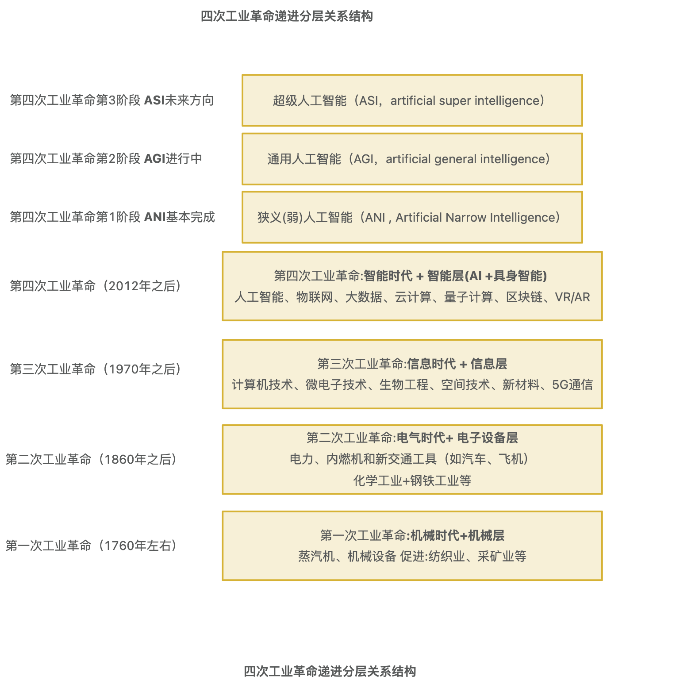
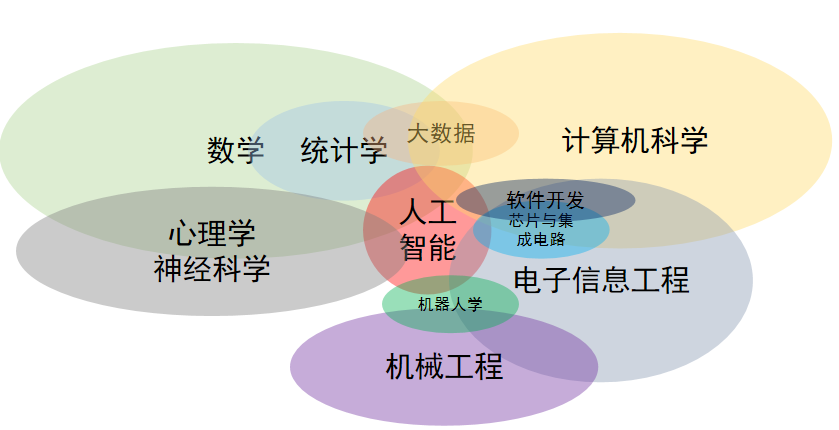
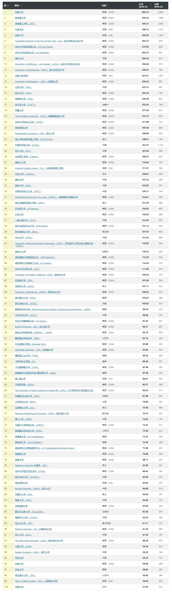
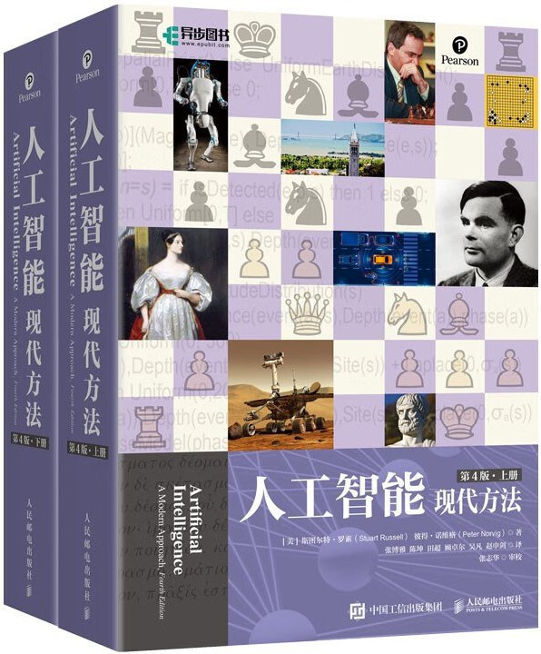

# ai-learning-roadmap 人工智能学习路线 V0.1
分享就是最好学习
# 该项目仪表盘
总体进度: 3%
构思大纲

# 目录
- [一、为什么要做这个项目？](#一-为什么要做这个项目)
  - [1 愿景和目标](#1-愿景和目标)
  - [2 前三次工业革命背景介绍](#2-前三次工业革命背景介绍)
  - [3 第四次工业革命在哪里](#3-第四次工业革命在哪里)
- [二、人工智能背景及学习方法](#二-人工智能背景及学习方法)
  - [1 人工智能的定义](#1-人工智能的定义)
  - [2 人工智能与其他学科的关系图](#2-人工智能与其他学科的关系图)
  - [3 AI领军人物和AITop100大学](#3-ai领军人物和aitop100大学)
  - [4 AI亚洲领军人物](#4-ai亚洲ai领军人物)
  - [5 自驱自学终身学习践行者-推荐布鲁姆分类法学习路径](#5-自驱自学终身学习践行者-推荐布鲁姆分类法学习路径)
- [三、人工智能学习路线](#三-人工智能学习路线)
  - [1 初级|中级|高级工程师(P4-P6)学习路线](#1-初级-中级-高级工程师p4-p6学习路线)
  - [2 专家|高级专家|资深专家(P7-P9)进阶路径](#2-专家-高级专家-资深专家-p7-p9-进阶路径)
  - [3 研究员|高级研究员|资深研究员|科学家|资深科学家(P10-P14)成神路径](#3-研究员-高级研究员-资深研究员-科学家-资深科学家-p10-p14-成神路径)
- [四、人工智能引领者](#四-人工智能引领者)
  - [1 国际引领者](#1-国际引领者)
  - [2 国内引领者](#2-国内引领者)
  - [3 行业引领者](#3-行业引领者)
  - [4 场景引领者](#4-场景引领者)

- [五、开源社区 项目 产品 应用](#五-开源社区-项目-产品-应用)

- [六、参考 引用](#六-参考-引用)

- [七、免责申明](#七-免责申明)

# 一 为什么要做这个项目
## 1 愿景和目标
通往ASI之路

### 要实现超级人工智能(ASI)也许有很长的路要走
### 我们的目标是让每个人的学习过程少走弯路，让更多的人因AI而强大！
### 让超级人工智能(ASI)为人类创造更加美好的明天！

AI是科学与艺术结合
我们相信 AGI 是模型x数据x算力的暴力美学，我们相信大模型是科研+工程+组织的优雅艺术。

人工智能远比其他技术更加深刻、更加强大。对个人来说风险不在于媒体过度炒作，而在于错过即将到来的AI浪潮。
既懂产品开发又精通AI的人才，我预计这种人才短缺将会加剧。
我相信，只要心中有光，就一定能照亮前行的道路。

## 2 前三次工业革命背景介绍

### 1. 第一次工业革命（18世纪末至19世纪初）
 - 起源：始于英国，约在1760年至1840年之间。
 - 核心技术：蒸汽机、纺织机械、煤矿开采、铁路建设。
 - 重要标志：
    - 蒸汽机的发明和应用，特别是詹姆斯·瓦特改进的蒸汽机，成为工业化的核心动力。
    - 纺织工业的机械化，取代了传统的手工劳动。
    - 铁路和蒸汽船的出现，推动了交通运输和商品流通。
 - 社会影响：大规模的机械化生产取代了手工业，促进了城市化进程，社会经济结构发生剧变。
### 2. 第二次工业革命（19世纪中期至20世纪初）
 - 起源：主要发生在19世纪中后期的欧美国家。
 - 核心技术：电力、内燃机、钢铁、化学工业、自动化。
 - 重要标志：
    - 电力的普及，尤其是发电技术的发展（如爱迪生和特斯拉的贡献），电力开始广泛应用于生产和生活中。
    - 内燃机和汽车的发明，亨利·福特的流水线生产方法大大提高了生产效率。
    - 钢铁工业的迅速发展，尤其是贝塞麦法（Bessemer Process）等技术的出现，使得钢铁大量生产成为可能。
    - 化学工业的兴起，催生了新的材料和药品的生产。
 - 社会影响：大规模的工业化和全球化的贸易，带来大规模的城市化、工人阶级的崛起以及社会结构的变化。
### 3. 第三次工业革命（20世纪中叶至末期）
 - 起源：从20世纪中期开始，尤其是在欧美和日本，持续到20世纪90年代。
 - 核心技术：信息技术、计算机、互联网、自动化控制。
 - 重要标志：
    - 计算机的普及，个人计算机和服务器的出现，使得信息处理能力大大增强。
    - 互联网的兴起，改变了全球通讯、信息流通和商业模式。
    - 自动化和机器人技术的应用，尤其是在制造业中，推动了生产效率的极大提升。
    - 数字化和信息化，从制造业到服务业，越来越多的行业开始依赖信息技术。
 - 社会影响：全球信息网络的形成，工作性质的变化，尤其是传统制造业与新兴技术产业之间的转型和替代。
### 4. 三次工业小结：
 - 第一次工业革命：蒸汽机和机械化生产。
 - 第二次工业革命：电力、内燃机、钢铁和化学工业。
 - 第三次工业革命：信息技术、计算机、手机、PC互联网、移动互联网和自动化。
每一次工业革命都极大地推动了社会经济和技术的进步，带来了工业生产方式、劳动力市场以及社会结构的深刻变化。

## 3 第四次工业革命在哪里
  也许在这里(没有人知道未来的事情，仅个人自己猜测和判断，不作为投资建议，注意: 市场有风险，投资需谨慎)

**第四次工业革命（也称为Industry 4.0）** 是指当前正在进行的一次技术革新浪潮，它的核心特征是将数字化、物理系统和生物技术结合起来，通过智能化的技术来推动生产和社会发展。这一革命并不像前三次工业革命那样有明确的开始时间，而是逐步发生的，它在21世纪初的某个时刻开始形成，并且依然在持续发展。

四次工业革命图如下:

### 1. 核心技术：
  - **人工智能（AI）**：利用机器学习、深度学习等技术，使机器能够进行复杂的任务决策、预测和自我优化。
    人工智能发展的三个阶段：
    - 1 ANI狭义人工智能（ANI , Artificial Narrow Intelligence）、
    - 2 通用人工智能（AGI，artificial general intelligence）、
    - 3 超级人工智能（ASI，artificial super intelligence）
  - **机器人技术**：智能机器人与自动化技术结合，能够更高效地执行生产任务，甚至实现自我学习。
  - **物联网（IoT, Internet of Things）**：将设备、传感器和机器联网，实现实时数据收集和分析，增强智能决策能力。
  - **自动|无人驾驶**：智能自动无人驾驶 天上飞的各种无人机或自动驾驶飞机、仿生类昆虫鸟类等等; 地上跑自动驾驶汽车、火车、地铁、物流车队、或地下勘探、矿类无人机器; 江河湖海洋水里自动|无人驾驶轮船 或潜艇 仿生海洋生物；
  - **大数据和云计算**：通过海量数据的收集、存储和处理，帮助企业做出更加精准的决策和运营优化。
  - **3D打印（增材制造）**：能够直接根据数字模型制造物品，极大地提高了生产的灵活性与定制化。
  - **虚拟现实与增强现实（VR/AR）**：增强了人的感知体验，广泛应用于设计、制造、医疗、教育等领域。
  - **区块链技术**：确保数据的安全性和透明度，尤其在金融、供应链等领域中获得应用。
  - **基因编辑与生物技术**：利用CRISPR等技术进行基因修改，带来医学和农业领域的重大突破。
### 2. 特征与影响：
  - **智能化与自动化**：生产线、物流、仓储等流程变得更加智能化，机器和设备能够自主工作，减少人工干预，提升效率和精度。
  - **融合与互联**：不同领域的技术（如AI、IoT、大数据等）相互融合，带来全新的商业模式和运营方式。
  - **数据驱动决策**：大量数据的采集和分析为企业提供实时、精确的运营支持，优化生产过程并做出灵活调整。
  - **定制化与个性化**：制造商可以根据市场需求和消费者的个性化要求快速调整生产，并通过3D打印等技术实现小批量生产。
  - **生产与服务边界模糊**：智能化技术不仅影响了传统制造业，也改变了服务业的运营模式，甚至开始出现智能服务和智能医疗等新兴行业。
### 3. 应用领域：
  - **制造业**：智能工厂、自动化生产线、机器协作和自适应生产。
  - **交通与物流**：无人驾驶汽车、智能交通系统、无人机配送。
  - **医疗健康**：精准医疗、个性化治疗、远程手术和机器人辅助手术。
  - **农业**：精准农业、自动化农业设备、智能灌溉系统。
  - **金融**：区块链、数字货币、智能合约、金融技术（FinTech）。
  - **零售**：虚拟现实购物、自动化库存管理、智能推荐系统。
### 4. 全球发展趋势：
第四次工业革命没有局限于某一个国家或地区，而是全球范围内的技术变革。它在不同地区和国家的表现形式有所不同，发达国家如美国、德国、日本和中国等，正在加快推进相关技术的研究和应用。
  - **美国**：科技公司和初创企业在AI、大数据、云计算等领域的创新推动了第四次工业革命。
  - **中国**：以人工智能、5G、物联网等技术为核心，推动制造业的转型升级，并在智能制造和数字经济领域取得了显著成就。
  - **德国**：提出了“工业4.0”概念，强调工业制造的数字化、智能化。

### 5. 面临的挑战：
  - **技术与人才短缺**：新技术的快速发展要求有大量专业技能人才，但目前各国仍面临技术人才短缺的问题。
  - **数据隐私和安全**：大量数据的采集和处理可能引发数据隐私泄露、网络安全问题。
  - **社会和劳动力转型**：自动化和人工智能将替代一些传统职业，带来就业结构变化，需要进行社会适应与再培训。
  - **伦理问题**：人工智能、基因编辑等技术的伦理界限仍是一个讨论的焦点，尤其是在人类基因改造和AI决策透明度等方面。
### 6. 总结：
第四次工业革命代表了技术的全面融合和智能化的飞速发展。它不仅仅是一场技术革命，更是一场社会、经济、政治乃至文化的深刻变革。随着AI、物联网、机器人等技术的广泛应用，世界各国都在积极推动这场变革，但也伴随着许多挑战和不确定性。

# 二 人工智能背景及学习方法
## 1 人工智能的定义
了解了人工智能的发展史后，我们现在或许可以大致理解现在对于人工智能的广泛定义——人工智能是人类设计的 机器或程序 所执行的与人类智能相对标的行为。
***
人类智能是人类理解和学习事物的能力，或者说，智能是 思考 和 理解能力 ，而不是本能做事的能力。例如：推理、判断、证明、决策、感知、理解、创作等多种多样的任务。
也可以说，人工智能是机器应用算法通过数据学习和使用所学，来进行如同人类决策的能力。
***
人工智能是数学、物理学、统计学、计算机科学、电子信息工程、控制工程、心理学、认知神经科学等多个 学科交叉 形成的产物。人工智能可以用来做机器人的一部分，可以用来做软件开发，可以赋能大数据，而5G代表的通信能力、芯片所代表的计算能力与存储能力又是人工智能得以发展起来的基座。这些学科彼此之间都有千丝万缕的联系，但绝对不能把它们简单地画等号。

## 2 人工智能与其他学科的关系图

## 3 AI领军人物和AITop100大学
## 3.1 全球AI最有影响力100人

## 3.2 杰夫·辛顿（Geoffrey Hinton）人工智能之父&图灵奖(2018)&诺贝尔物理学奖(2024)AI人物脉络图

## 3.3 《Nature》发布2024人工智能Top100大学榜单
国际Top3： 哈佛大学、斯坦福大学、麻省理工学院(MIT)
***
国内Top3:   清华大学()、北京大学、中国科学院大学
***
注: 2024年4月27日,清华大学人工智能学院-该学院由计算机科学最高奖“图灵奖”得主、中国科学院院士姚期智先生领导  重点布局“人工智能核心”与“人工智能+”两大前沿方向。
***

## 4 ai亚洲AI领军人物
  - **1 姚期智** :2024年4月27日,清华大学人工智能学院-该学院由计算机科学最高奖“图灵奖”得主、中国科学院院士姚期智先生领导  重点布局“人工智能核心”与“人工智能+”两大前沿方向。
   姚期智 / Andrew Chi-Chih Yao  https://iiis.tsinghua.edu.cn/zh/yao/
   出版书籍 《人工智能 (高中版)》(2021-5)  《人工智能》(大学)(2022-8-1)

  - **2 周志华** 南京大学副校长、计算机学院院长、人工智能学院院长（兼）
    周志华，男，汉族，1973年11月出生，江苏盐城人，无党派人士，研究生学历，博士学位，教授，人工智能研究专家 [40] [43]。南京大学副校长 [42-43]、校学术委员会委员 [23]，南京大学计算机学院院长 [1]，南京大学人工智能学院院长（兼） [33-34]，计算机软件新技术国家重点实验室常务副主任、机器学习与数据挖掘研究所所长 [2]。
    周志华主要从事人工智能、机器学习、数据挖掘等领域的研究工作
    个人主页: https://cs.nju.edu.cn/zhouzh/
    出版书籍  周志华 著.机器学习 (西瓜书),北京:清华大学出版社,2016
    《机器学习理论导引》周志华, 王魏, 高尉, 张利军 著.机器学习理论导引,北京:机械工业出版社,2020. (ISBN 978-7-111-65424-7)
    《演化学习：理论与算法进展》(2019)

 - **3 张志华** 
    北京大学 张志华 北京大学数学科学学院教授，所在部门为统计学教研室，兼任Journal of Machine Learning Research 执行编委。
    个人主页: https://www.math.pku.edu.cn/teachers/zhzhang/

  - **4 DeepSeek 梁文锋**
    DeepSeek大模型出圈

    机器学习方法 李航

## 5 自驱自学终身学习践行者-推荐布鲁姆分类法学习路径

推荐布鲁姆分类法学习路径
#### 1.记忆：先从AI的历史、基本术语、重要人物、方法和原理等开始了解，看看入门课程
#### 2.理解：进一步了解 AI 领域的主要思想和概念，将精选 AI 网站和APP 产品都试一试 CS专业课要回顾 做实验Demo和项目，加深了解
#### 3.应用：深入了解数据科学、数学、AI、机器学习、深度学习、Prompt、Agent等，选择适合自己的AI 对话、绘画和语音产品，每天都用它，并使用它们来解决实际问题或提升效率
#### 4.分析：训练较好的国际交流语言(如应用)大量阅读各类文章、视频以及行业报告，理解各知识之间的关系
#### 5.评价：通过各类课程与书籍更深入学习、开源项目、社团、公司访谈等，判断信息的价值、提出自己的观点和论证
#### 6.创造：积极参与社区、开源组织共创项目，创造你自己的新想法或产品 商用产品 创造美好生活

# 三 人工智能学习路线
按专业P线(参考某大厂技术P线 Professional)
## 1 初级 中级 高级工程师P4-P6学习路线
follower
### 人工智能基础
https://github.com/ajian005/program-language-python
1. 人工智能中的数学基础：不做要求
2. 人工智能中的编程基础：Python基础
3. 人工智能中的数据处理基础：NumPy基础
4. 人工智能中的数据处理基础：Pandas基础
5. 人工智能中的数据可视化基础：Matplotlib基础
6. 人工智能中的数据结构和数据分析基础：Pandas基础
### 人工智能开源工具
https://github.com/ajian005/ai-machineLearning-python
1. 机器学习框架：scikit-learn
2. 深度学习框架：PyTorch
3. NLP工具库：transformers
4. CV工具库：OpenMMLab
### 机器学习基础
1. 机器学习的基本概念
2. 机器学习的经典模型：线性回归、对数几率回归、决策树、SVM、神经网络等
3. 机器学习代码实践
4. 机器学习应用案例
### 深度学习基础
https://github.com/ajian005/ai-deepLearning-python
1. 深度学习（神经网络）的基本概念和发展历史
2. 神经网络的优化方法
3. 经典神经网络：CNN、ResNet、RNN、LSTM、Transformer、GPT等
4. 深度学习代码实践
5. 深度学习应用案例
### 大模型理论与实践
1. 大模型基础：数据、架构、训练
2. 大模型微调：全参数微调、PEFT微调
3. 大模型应用技术：Prompt工程、RAG、Agent
4. 文生图、图生文、图生图、文生视频原理与实践
5. 多模态大模型原理与实践
### 强化学习基础
1. 强化学习原理
2. 强化学习经典算法
3. 强化学习的应用
### 人工智能安全与伦理
1. 人工智能安全介绍
2. 人工智能伦理介绍
### 人工智能综合应用实践
1. 人工智能综合应用实践

## 2 专家 高级专家 资深专家 P7-P9 进阶路径
creator
对专业热爱或者狂热 持续的 
认知能力 
终身学习能力

### 2-1基本功方面
#### 数学基本功: 高等数学、线性代数、概率论数理统计与随机过程、信息论、最优化理论等
##### 《数学手册》 主要的数学公式汇总
      数学手册 https://book.douban.com/subject/1089331/
#### 语言基本功:中文、英文
      英文词汇量: 8000以上
#### 架构设计
#### 程序设计语言: C++/Java/Python
#### 技术前沿视野(跟踪|跟进|趋势|规划|判断|引领等)能力

#### 数据结构和算法
#### 计算机科学与技术专业课(计算机体系结构、操作系统、数据库&搜索&推荐、程序设计语言、数据结构和算法、数值与符号计算、人机交互、软件工程、人工智能)
#### 数据科学
#### 认知科学
#### 批判性思维

### 2-2综合能力
#### 规划、汇报、说服、争取方向和资源能力
#### 项目协同管理推进能力 沟通表达能力 (组织协同10-500人左右)
#### 运营|销售|市场|商务|基础能力(半个运营)  路演 融资 商业计划书等能力
#### 产品能力toB|toC|toG等等基础能力(半个产品)
#### 眼光、伯乐、胸怀

### 2-3专业技能

#### 人工智能
熟练掌握深度学习各类模型架构的使用和设计。
##### 《Artificial Intelligence A Modern Approach, 4th Edition》《人工智能 现代方法第4版》
  英文《Artificial Intelligence A Modern Approach, 4th Edition》(出版年:2020-3) https://book.douban.com/subject/35046440/
  ###
  中文《人工智能 现代方法第4版》人工智能（第4版）(出版年:2022-11)  https://book.douban.com/subject/36152133/
  
  ###
  本书全面、深入地探讨了人工智能（AI）领域的理论和实践，以统一的风格将当今流行的人工智能思想和术语融合到引起广泛关注的应用中，真正做到理论和实践相结合。

#### 机器学习
精通机器学习（深度学习），具备创新研究能力。
#### 深度学习 神经网络
编程能力出色，熟练掌握至少两种编程语言，熟练掌握Tensorflow/Pytorch。
#### AI 基础设施层
计算机体系结构-GPU 选型和搭建网络
随着AIGC技术的迅猛发展，以Nvidia和AWS为代表的算力芯片和云计算供应商正在成为了基础设施层的核心力量，他们通过提供高性能算力支撑，为AIGC时代的科技进步奠定了坚实基础。
算力需求可以进一步细分为训练算力和推理算力两种类型

在基础设施层有了算力和数据这两大重要支撑后，开始慢慢形成基础工具与框架这个承上启下的关键环节。它负责将通用大模型调整为更适合具体应用需求的工具。这部分主要包括以下两类角色：

基础工具：如Diffusers和Hugging Face等，它们能够帮助用户快速调整和部署模型。
基础框架：如PyTorch和TensorFlow等，这些深度学习框架提供了构建AI应用的底层技术支持。

以Hugging Face为例，它已发展为全球最大的AI社区和平台。在这个平台上，用户可以共享和托管AI模型与数据集，还可以轻松地构建、训练和部署AI模型。与此同时，Hugging Face也在探索多元化商业化路径，例如私人模型库、模型推理服务和AutoTrain工具等。这些基础工具和框架不仅降低了AIGC技术的门槛，还为整个AI行业注入了新活力，预计未来这一领域将迎来更多创新和机遇。

AIGC基础设施层是整个生态系统的核心驱动力。

#### 大数据工程-数据收集、分析、处理等
数据供应可以说是AIGC时代的关键资源。在AIGC产业中，数据供应商的角色至关重要。他们主要负责提供数据制作、储备、标注和合规服务，为AIGC模型的更新优化提供强有力的支持。高质量且符合伦理的数据是构建强大 AI 模型的基石。随着AIGC时代的持续发展，数据供应商的竞争力将不再局限于单纯的数据量，而是转向数据的质量、覆盖范围以及服务的精细化程度。
职责
1. 遵循robots 协议，对互联网公开信息进行采集；
2. 负责网页信息抽取技术算法的研究和开发，提升数据采集的效率和质量；
3. 负责设计和开发分布式的网络数据采集技术，能独立解决实际开发过程碰到的各类问题(优化调度、并发、覆盖率等) ，提升数据采集的效果与性能;
4. 负责数据采集解析入库、系统异常监控与警报等。
要求
1. 具备扎实的编程能力、优秀的设计能力和代码品味，具有强烈的责任心
2. 熟练掌握HTML、JavaScript、Python、Scrapy等，能快速完成采集脚本的编写;
3. 了解主流网络数据采集技术和框架工具，如Selenium/Puppeteer/PhantomJS/Scrapy等;
4. 了解NLP基本技术，实际使用过如 Fasttext、N-gram、Bert、GPT 等算法和模型者优先；
5. 熟悉常见限制访问服务器资源和获取数据技术，具备相关的实战经验。
数据百晓生
-大模型安全：负责构建LLM内容安全的能力，比如回复干预，输入安全，输出安全等多层内容安全机制，保证大模型在单轮、多轮场景下的输出内容合规；

-数据集相关：根据数据集的设计需求和用途，为数据集标准环节制定详实、全面、可执行的标准；参与数据标注平台的设计与搭建，协助设计标注平台的交互界面；对数据集阶段性质检，迭代标注标准；

-大模型评估：测评 AGI 模型的能力边界，实时跟进大模型发布进展，设计模型评估维度，反馈给团队评估结果，并能从数据的视角提出优化模型方案；

-产品设计：根据团队计划，适时开发大模型应用demo，设计前后端交互界面；

#### 大模型层
AIGC模型层

##### 1 预训练基础通用大模型
通用预训练大模型：覆盖多模态、多行业的基础模型。

##### 2 行业垂直大模型
特定行业垂直大模型：专注于特定领域（如金融、医疗）的定制化模型。

##### 3 端侧大模型
端侧大模型：用于设备端的轻量级模型，满足终端设备的实时推理需求。
#### Agent&提示词
#### 工程能力
#### 运维能力
#### 自然语言处理NLP
#### 计算机视觉CV
#### 机器人学
#### 数据挖掘：信息检索、推荐系统、大数据系统
#### AI fo science
#### AI道德、法律、治理、合规、安全、可解释性等

#### 视野宽广: 最近2年Paper阅读跟进和实验落地能力

### 2-4行业应用
古今中外商业落地的形式可以归结为两种：ToB和ToC，AIGC时代也不例外。
从短期来看，基于AIGC的消费级应用会重新崛起。像GPT-4和MidJourney这样的算法解决方案即产品的“杀手级应用”（Killer Apps），正成为AIGC应用层最有价值的形式。这些消费级应用展示了AIGC技术的强大潜力，也AI行业树立了标杆。
大模型的微调和优化对AIGC应用层的公司来说至关重要:
1 对商业闭环有敏锐的洞察力。
2 快速响应用户需求，不断提升产品的易用性。
3 通过持续迭代，构建产品护城河。
从长期来看，存在基于AIGC的ToC平台级产品的可能性
#### 机器人
#### 健康
#### 生物医药 医疗 癌症
#### 医疗
#### 金融
   股票等自动化交易和量化交易
#### 汽车
#### 教育
#### 自动驾驶
#### 脑机接口
#### 安全领域
#### 软件领域

### 2-5产品输出价值
   1 要有行业拿的出口、叫得响名字的产品 (行业或国内)
   2 发表Paper对行业有一定影响 (行业或国内)
    如:有丰富的研究成果，在国际顶会或期刊发表相关论文（包括但不限于NIPS, ICML, CVPR, COLT)。

## 3 研究员 高级研究员 资深研究员 科学家 资深科学家 P10-P14 成神路径
leader
基础:
   英文词汇量: 15000以上
### 方向规划 战略规划
### 路演融资能力
### 公司级或开源组织级别搭建并运营能力
### 行业影响力

### 发表Paper能力
   1 要有行业拿的出口、叫得响名字的产品 (全球影响)
   2 在自然或人工智能等核心期刊发表对行业有重大贡献的高水平论文 (全球影响)

### 科学界影响力
### 行业影响力
  1. 设计开拓性的新的深度神经网络
  2. 构建科学、严谨的算法评测体系
  3. 紧跟领域前沿，推动基础研究
### 数学和算法底层方面

### Paper方面

### AI fo science

### 产品方面

### 应用方面

### 场景应用方面

# 四 人工智能引领者
## 1 国际引领者
### OpenAI
  https://chatgpt.com/
### Google Gemine
  https://gemini.google.com/
### ### anthropic Claude
  https://claude.ai/login?returnTo=%2F%3F
### x.ai (马斯克AI) https://x.com/i/grok
### Stargate 星际之门
    2025.01月特朗普上任美国总统推动，有OpenAI、软银和甲骨文等投资5000亿美金(3.5万亿人民币左右)  构建人工智能基础设施
### meta https://ai.meta.com/blog/meta-llama-3-1/
### Nvidia https://huggingface.co/nvidia
### HuggingFace
  https://huggingface.co/learn
### Reka AI
### AI21 Labs
### Princeton
### Cohere
### InternLM

### Microsoft

### Databricks

### AllenAI/UW

### IBM

### OpenChat

### MSYS

### Snowflake

### UC Berkeley

## 2 国内引领者
### 阿里-通义千问
蚂蚁支付宝-百灵语言大模型
### 字节跳动-豆包
字节豆包大模型
### 百度-文心一言
百度智能云千帆大模型
### 360大模型
### 清华-质谱华章
### 零一万物(李开复)
### 阶跃星辰
### 硅基流动
### 科大讯飞
### 月之暗面
### deepseek 深度求索  https://github.com/deepseek-ai
    AI的一匹黑马
    幻方量化基金 https://www.high-flyer.cn/
    （DeepSeek最新文章观点学术报告及业界评论）详解：DeepSeek深度推理+联网搜索 目前断档第一：https://waytoagi.feishu.cn/wiki/D9McwUWtQiFh9sksz4ccmn4Dneg?from=from_parent_docs

## 3 行业引领者

## 4 各场景引领者

# 五 开源社区 项目 产品 应用

# 六 参考 引用

# 七 免责申明
