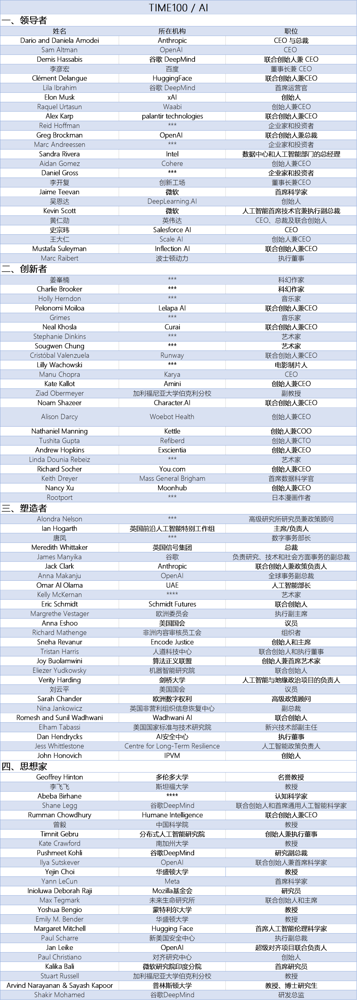

# ai-learning-roadmap 人工智能学习路线 V0.1
分享就是最好学习
# 该项目仪表盘
总体进度: 2%
构思大纲

# 目录
- [一、为什么要做这个项目？](#一-为什么要做这个项目)
  - [1 愿景和目标](#1-愿景和目标)
- [二、人工智能背景及学习方法](#二-人工智能背景及学习方法)
  - [1 人工智能的定义](#1-人工智能的定义)
  - [2 人工智能与其他学科的关系图](#2-人工智能与其他学科的关系图)
  - [3 AI领军人物和AITop100大学](#3-ai领军人物和aitop100大学)
  - [4 自驱自学终身学习践行者-推荐布鲁姆分类法学习路径](#4-自驱自学终身学习践行者-推荐布鲁姆分类法学习路径)
- [三、人工智能学习路线](#三-人工智能学习路线)
  - [1 初级|中级|高级工程师(P4-P6)学习路线](#1-初级-中级-高级工程师p4-p6学习路线)
  - [2 专家|高级专家|资深专家(P7-P9)进阶路径](#2-专家-高级专家-资深专家-p7-p9-进阶路径)
  - [3 研究员|高级研究员|资深研究员|科学家|资深科学家(P10-P14)成神路径](#3-研究员-高级研究员-资深研究员-科学家-资深科学家-p10-p14-成神路径)
- [四、人工智能引领者](#四-人工智能引领者)
  - [1 国际引领者](#1-国际引领者)
  - [2 国内引领者](#2-国内引领者)
  - [3 行业引领者](#3-行业引领者)
  - [4 场景引领者](#4-场景引领者)

- [五、开源社区 项目 产品 应用](#五-开源社区-项目-产品-应用)

- [六、参考 引用](#六-参考-引用)

- [七、免责申明](#七-免责申明)

# 一 为什么要做这个项目
## 1 愿景和目标
通往ASI之路

### 要实现超级人工智能(ASI)也许有很长的路要走
### 我们的目标是让每个人的学习过程少走弯路，让更多的人因AI而强大！
### 让超级人工智能(ASI)为人类创造更加美好的明天！

# 二 人工智能背景及学习方法
## 1 人工智能的定义
了解了人工智能的发展史后，我们现在或许可以大致理解现在对于人工智能的广泛定义——人工智能是人类设计的 机器或程序 所执行的与人类智能相对标的行为。
***
人类智能是人类理解和学习事物的能力，或者说，智能是 思考 和 理解能力 ，而不是本能做事的能力。例如：推理、判断、证明、决策、感知、理解、创作等多种多样的任务。
也可以说，人工智能是机器应用算法通过数据学习和使用所学，来进行如同人类决策的能力。
***
人工智能是数学、物理学、统计学、计算机科学、电子信息工程、控制工程、心理学、认知神经科学等多个 学科交叉 形成的产物。人工智能可以用来做机器人的一部分，可以用来做软件开发，可以赋能大数据，而5G代表的通信能力、芯片所代表的计算能力与存储能力又是人工智能得以发展起来的基座。这些学科彼此之间都有千丝万缕的联系，但绝对不能把它们简单地画等号。

## 2 人工智能与其他学科的关系图

## 3 AI领军人物和AITop100大学
## 3.1 全球AI最有影响力100人

## 3.2 杰夫·辛顿（Geoffrey Hinton）人工智能之父&图灵奖(2018)&诺贝尔物理学奖(2024)AI人物脉络图

## 3.3 《Nature》发布2024人工智能Top100大学榜单
国际Top3： 哈佛大学、斯坦福大学、麻省理工学院(MIT)
***
国内Top3:   清华大学()、北京大学、中国科学院大学
***
注: 2024年4月27日,清华大学人工智能学院-该学院由计算机科学最高奖“图灵奖”得主、中国科学院院士姚期智先生领导  重点布局“人工智能核心”与“人工智能+”两大前沿方向。
***

## 4 自驱自学终身学习践行者-推荐布鲁姆分类法学习路径

推荐布鲁姆分类法学习路径
#### 1.记忆：先从AI的历史、基本术语、重要人物、方法和原理等开始了解，看看入门课程
#### 2.理解：进一步了解 AI 领域的主要思想和概念，将精选 AI 网站和APP 产品都试一试 CS专业课要回顾 做实验Demo和项目，加深了解
#### 3.应用：深入了解数据科学、数学、AI、机器学习、深度学习、Prompt、Agent等，选择适合自己的AI 对话、绘画和语音产品，每天都用它，并使用它们来解决实际问题或提升效率
#### 4.分析：训练较好的国际交流语言(如应用)大量阅读各类文章、视频以及行业报告，理解各知识之间的关系
#### 5.评价：通过各类课程与书籍更深入学习、开源项目、社团、公司访谈等，判断信息的价值、提出自己的观点和论证
#### 6.创造：积极参与社区、开源组织共创项目，创造你自己的新想法或产品 商用产品 创造美好生活

# 三 人工智能学习路线
按专业P线(参考某大厂技术P线 Professional)
## 1 初级 中级 高级工程师P4-P6学习路线
待遇水平:年包 30W-50W左右
### 人工智能基础
1. 人工智能中的数学基础：不做要求
2. 人工智能中的编程基础：Python基础
3. 人工智能中的数据处理基础：NumPy基础
4. 人工智能中的数据处理基础：Pandas基础
5. 人工智能中的数据可视化基础：Matplotlib基础
6. 人工智能中的数据结构和数据分析基础：Pandas基础
### 人工智能开源工具
1. 机器学习框架：scikit-learn
2. 深度学习框架：PyTorch
3. NLP工具库：transformers
4. CV工具库：OpenMMLab
### 机器学习基础
1. 机器学习的基本概念
2. 机器学习的经典模型：线性回归、对数几率回归、决策树、SVM、神经网络等
3. 机器学习代码实践
4. 机器学习应用案例
### 深度学习基础
1. 深度学习（神经网络）的基本概念和发展历史
2. 神经网络的优化方法
3. 经典神经网络：CNN、ResNet、RNN、LSTM、Transformer、GPT等
4. 深度学习代码实践
5. 深度学习应用案例
### 大模型理论与实践
1. 大模型基础：数据、架构、训练
2. 大模型微调：全参数微调、PEFT微调
3. 大模型应用技术：Prompt工程、RAG、Agent
4. 文生图、图生文、图生图、文生视频原理与实践
5. 多模态大模型原理与实践
### 强化学习基础
1. 强化学习原理
2. 强化学习经典算法
3. 强化学习的应用
### 人工智能安全与伦理
1. 人工智能安全介绍
2. 人工智能伦理介绍
### 人工智能综合应用实践
1. 人工智能综合应用实践

## 2 专家 高级专家 资深专家 P7-P9 进阶路径
待遇水平:年包 50W-500W左右(含股票期权等)
对专业热爱或者狂热 持续的 
认知能力 
终身学习能力

### 基本功方面
#### 数学基本功: 高等数学、线性代数、概率论数理统计与随机过程、信息论、最优化理论等
##### 《数学手册》 主要的数学公式汇总
      数学手册 https://book.douban.com/subject/1089331/
#### 语言基本功:中文、英文
      英文词汇量: 8000以上
#### 架构设计
#### 程序设计语言: C++/Java/Python

#### 数据结构和算法
#### 计算机科学与技术专业课(计算机体系结构、操作系统、数据库&搜索&推荐、程序设计语言、数据结构和算法、数值与符号计算、人机交互、软件工程、人工智能)
#### 数据科学
#### 认知科学
#### 批判性思维

### 综合能力
#### 规划、汇报、说服、争取方向和资源能力
#### 项目协同管理推进能力 沟通表达能力 (组织协同10-500人左右)
#### 运营|销售|市场|商务|基础能力(半个运营)
#### 产品能力toB|toC|toG等等基础能力(半个产品)
#### 眼光、伯乐、胸怀

### 专业技能
#### 人工智能
##### 《Artificial Intelligence A Modern Approach, 4th Edition》《人工智能 现代方法第4版》
  英文《Artificial Intelligence A Modern Approach, 4th Edition》(出版年:2020-3) https://book.douban.com/subject/35046440/
  ###
  中文《人工智能 现代方法第4版》人工智能（第4版）(出版年:2022-11)  https://book.douban.com/subject/36152133/
  
  ###
  本书全面、深入地探讨了人工智能（AI）领域的理论和实践，以统一的风格将当今流行的人工智能思想和术语融合到引起广泛关注的应用中，真正做到理论和实践相结合。

#### 机器学习
#### 深度学习 神经网络
#### 大模型
#### 计算机体系结构-GPU 选型和搭建网络
#### 大数据工程-数据收集、分析、处理等
#### 预训练基础通用大模型
#### 行业大模型
#### Agent&提示词
#### 工程能力
#### 运维能力
#### 自然语言处理NLP
#### 计算机视觉CV
#### 机器人学
#### 数据挖掘：信息检索、推荐系统、大数据系统

#### 视野宽广: 最近2年Paper阅读跟进和实验落地能力

### 行业应用
#### 机器人
#### 健康
#### 生物医药 医疗 癌症
#### 医疗
#### 金融
#### 汽车
#### 教育
#### 自动驾驶
#### 脑机接口
#### 安全领域
#### 软件领域

### 产品输出价值
   1 要有行业拿的出口、叫得响名字的产品 (行业或国内)
   2 发表Paper对行业有一定影响 (行业或国内)

## 3 研究员 高级研究员 资深研究员 科学家 资深科学家 P10-P14 成神路径
待遇水平:年包 100W-5000W左右(含股票期权等)
基础:
   英文词汇量: 15000以上
### 方向规划 战略规划
### 路演融资能力
### 公司级或开源组织级别搭建并运营能力
### 行业影响力

### 发表Paper能力
   1 要有行业拿的出口、叫得响名字的产品 (全球影响)
   2 在自然或人工智能等核心期刊发表对行业有重大贡献的高水平论文 (全球影响)
### 科学界影响力
### 行业影响力

### 数学和算法底层方面

### Paper方面

### 产品方面

### 应用方面

### 场景应用方面

# 四 人工智能引领者
## 1 国际引领者
### OpenAI
  https://chatgpt.com/
### Google Gemine
  https://gemini.google.com/
### ### anthropic Claude
  https://claude.ai/login?returnTo=%2F%3F
### x.ai (马斯克AI) https://x.com/i/grok
### Stargate 星际之门
    2025.01月特朗普上任美国总统推动，有OpenAI、软银和甲骨文等投资5000亿美金(3.5万亿人民币左右)  构建人工智能基础设施
### meta https://ai.meta.com/blog/meta-llama-3-1/
### Nvidia https://huggingface.co/nvidia
### HuggingFace
  https://huggingface.co/learn
### Reka AI
### AI21 Labs
### Princeton
### Cohere
### InternLM

### Microsoft

### Databricks

### AllenAI/UW

### IBM

### OpenChat

### MSYS

### Snowflake

### UC Berkeley

## 2 国内引领者
### 阿里-通义千问
蚂蚁支付宝-百灵语言大模型
### 字节跳动-豆包
字节豆包大模型
### 百度-文心一言
百度智能云千帆大模型
### 360大模型
### 清华-质谱华章
### 零一万物(李开复)
### 阶跃星辰
### 硅基流动
### 科大讯飞
### 月之暗面

## 3 行业引领者

## 4 各场景引领者

# 五 开源社区 项目 产品 应用

# 六 参考 引用

# 七 免责申明
